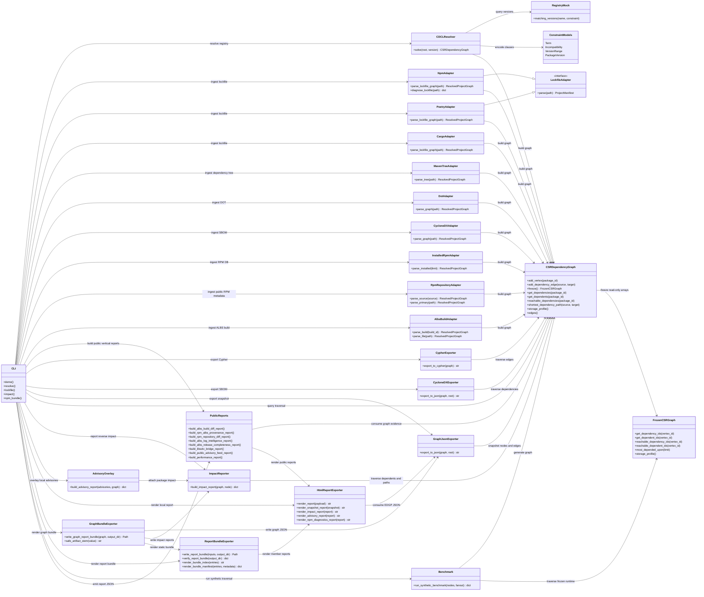
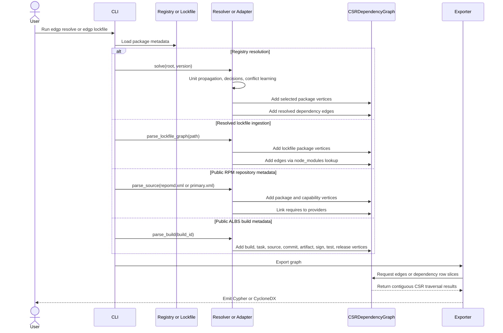
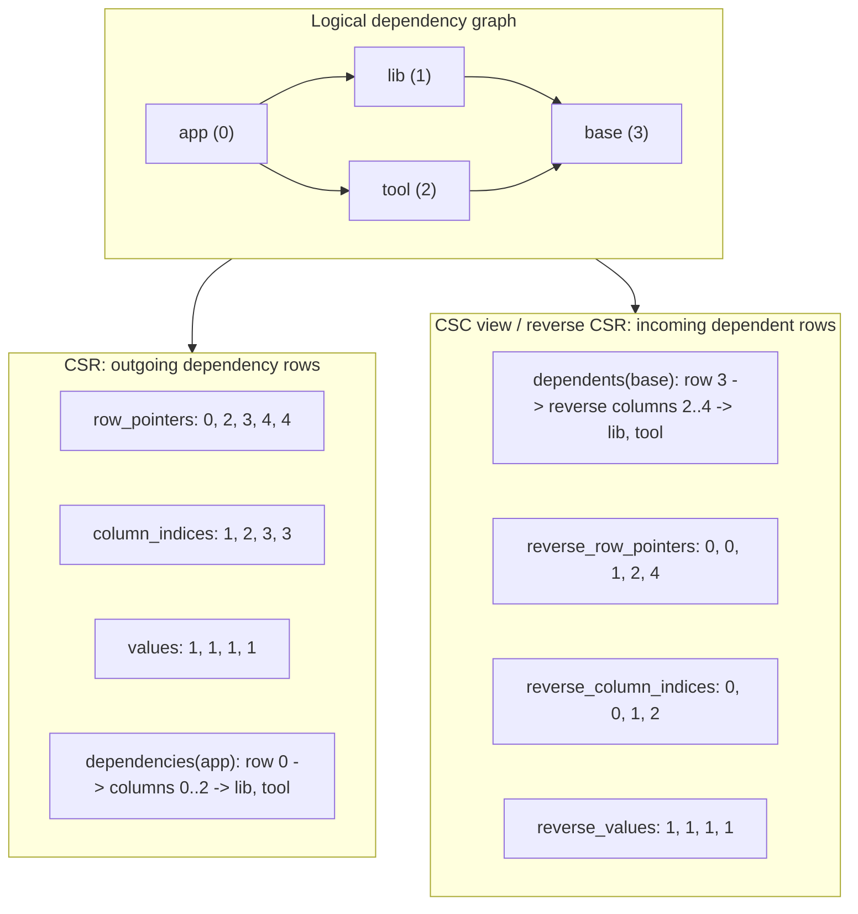

# Enterprise Dependency Graph Pipeline


Enterprise Dependency Graph Pipeline (EDGP) is a prototype for building,
resolving, storing, and exporting software dependency graphs at supply-chain
scale.

The design follows the research notes in
[`docs/Architecture and Traversal of Massive-Scale Dependency Graphs.md`](docs/Architecture%20and%20Traversal%20of%20Massive-Scale%20Dependency%20Graphs.md):

- graph topology is represented with Compressed Sparse Row (CSR) arrays;
- dependency resolution uses a PubGrub/CDCL-inspired loop with learned
  incompatibilities;
- resolved graphs can be exported as Neo4j Cypher or CycloneDX SBOM JSON.

The post-MVP performance path is tracked in
[`docs/MVP Plus Performance Roadmap.md`](docs/MVP%20Plus%20Performance%20Roadmap.md).

This is intentionally small enough to inspect, test, and extend. It is not a
drop-in replacement for mature package-manager solvers such as libsolv,
PubGrub, or Cargo, but it gives the project a concrete architecture for those
ideas.

## Core Capabilities

EDGP focuses on local, inspectable graph workflows:

- Build: ingest resolved dependency data from npm, Poetry, Cargo, Maven
  dependency trees, CycloneDX SBOMs, DOT/RPM graphs, bounded local RPM
  database snapshots, public RPM repository metadata, plus public ALBS build
  metadata.
- Analyze: query reachability, dependents, shortest paths,
  most-depended-upon packages, npm path conflicts, advisory overlays, and
  reverse impact. Public RPM reports summarize and compare repository
  snapshots. Public ALBS reports compare builds, summarize release coverage,
  extract log signals, and join installed RPMs back to build artifacts.
- Export: emit deterministic EDGP JSON, CycloneDX, Neo4j Cypher, static HTML
  reports, report bundles, and bundle verification manifests.
- Validate: run smoke checks from the installed project environment, schema
  validation, bundle verification, libsolv bridge checks, and synthetic CSR
  traversal benchmarks.

## Repository Layout

```text
src/
  adapters/        Manifest readers for ecosystems such as npm and Poetry
  core_graph/      CSR dependency graph implementation
  models/          Package, version, and incompatibility models
  output/          Cypher and CycloneDX exporters
  resolver/        CDCL-inspired resolver and mock registry
tests/
  fixtures/        Public-derived samples plus synthetic edge-case payloads
```

Fixture provenance is tracked in
[`tests/fixtures/README.md`](tests/fixtures/README.md) and as the
machine-readable catalog
[`tests/fixtures/fixture-provenance.json`](tests/fixtures/fixture-provenance.json).
The RPM repository fixtures include curated AlmaLinux 9 AppStream
`primary.xml` excerpts, while small synthetic fixtures remain where they make
parser and validation edge cases easier to audit. Public-derived report
fixtures can be refreshed with
`python -B scripts/generate_public_fixture_reports.py`; the provenance catalog
can be refreshed with `python -B scripts/generate_fixture_provenance.py`.
Both generators support `--check` for CI. The same catalog is available through
`edgp fixture-provenance` and can be rendered as a verifiable static bundle with
`edgp fixture-provenance-bundle`. `edgp real-data-coverage` turns that catalog
into a compact data-quality report that separates direct public evidence,
generated public reports, and intentionally synthetic fixtures with replacement
priorities. `edgp real-data-replacement-plan` turns those priorities into a
ranked backlog of fixture groups that should move toward public-derived data
where practical. `edgp real-data-coverage-diff` compares two such reports so
public evidence regressions can be reviewed or blocked in CI.

## Quick Start

### Install And Validate

```bash
python -m venv .venv
source .venv/bin/activate
python -m pip install -e ".[dev]"
pytest
```

```bash
python -B scripts/smoke_validate.py
python -B scripts/smoke_validate.py --include-rpm-installed
```

### Build Graphs

Start with the demo resolver, then ingest real resolved dependency inputs:

```bash
edgp demo --format cypher
edgp demo --format cyclonedx
edgp lockfile --path package-lock.json --format cypher
edgp lockfile --path package-lock.json --format cyclonedx
edgp lockfile --path package-lock.json --format json
edgp export-batch --snapshot graph.json --output-dir exports --format cypher --format cyclonedx
edgp report --input exports/manifest.json --output export-batch.html
edgp verify-export-batch --path exports --format text
edgp archive-export-batch --path exports --output exports.tar.gz --format text
edgp verify-export-batch-archive --path exports.tar.gz --format text
edgp plan-export-batch-submission --path exports.tar.gz --target dependency-track --endpoint https://dependency-track.example/api/v1/bom --format text
edgp submission-plan-index --input export-submission.json --input bundle-submission.json --format text
edgp report --input submission-index.json --output submission-index.html
```

Use ecosystem-specific adapters when the input format is already resolved:

```bash
edgp lockfile --ecosystem poetry --path poetry.lock --format json
edgp lockfile --ecosystem cargo --path Cargo.lock --format json
mvn dependency:tree -DoutputFile=maven-tree.txt
edgp maven-tree --path maven-tree.txt --format json
```

SBOM, DOT/RPM, and installed RPM sources are supported for system-oriented
investigation. Use bounded limits for local RPM database exploration, or fetch
public ALBS build metadata by build ID, local JSON path, or public JSON URL.

```bash
edgp sbom --path bom.json --format json
edgp dot --path repograph.dot --ecosystem rpm --format json
edgp dot --path repograph.dot --ecosystem rpm --format cyclonedx
edgp rpm-installed --limit 100 --max-requirements 40 --format json
edgp rpm-repo --source https://repo.almalinux.org/almalinux/10/BaseOS/x86_64/os/ --repo-id alma-baseos --format json
edgp rpm-repo-summary --source repodata/repomd.xml
edgp rpm-repo-summary-bundle --source repodata/repomd.xml --output-dir reports/rpm-repo-summary --triage-summary
edgp rpm-repo-diff --left-source old/repodata/repomd.xml --right-source new/repodata/repomd.xml
edgp rpm-repo-bundle --source repodata/repomd.xml --output-dir reports/rpm-repo --impact-node glibc --advisories advisories.json --public-advisory-feed osv.json --libsolv-transaction solver-transaction.txt --license-report --triage-summary
edgp albs-build --build-id 17812 --format json
edgp albs-build --url https://build.almalinux.org/api/v1/builds/17812/ --format json
edgp albs-artifact-inventory --build-id 17812
edgp albs-artifact-inventory-bundle --build-id 17812 --output-dir reports/albs-artifact-inventory --triage-summary
edgp albs-build-timing --build-id 17812
edgp albs-build-timing-bundle --build-id 17812 --output-dir reports/albs-build-timing --triage-summary
edgp albs-build-diff --left-build-id 17812 --right-build-id 17813
edgp albs-build-diff-bundle --left-build-id 17812 --right-build-id 17813 --output-dir reports/albs-build-diff --triage-summary
edgp albs-release-completeness --build-id 17812 --build-id 17813
edgp albs-log-intelligence --build-id 17813
edgp albs-log-intelligence-bundle --build-id 17813 --output-dir reports/albs-log-intelligence --triage-summary
edgp albs-release-completeness-bundle --build-id 17812 --build-id 17813 --output-dir reports/albs-release-completeness --triage-summary
edgp rpm-albs-provenance --build-id 17812 --rpm-limit 200
edgp rpm-albs-provenance-bundle --build-id 17812 --rpm-limit 200 --output-dir reports/rpm-albs-provenance --triage-summary
edgp libsolv-bridge --transaction solver-transaction.txt
edgp libsolv-bridge --transaction solver-transaction.txt --graph-snapshot rpm-repo-graph.json
edgp libsolv-bundle --transaction solver-transaction.txt --graph-snapshot rpm-repo-graph.json --output-dir reports/libsolv
edgp public-advisory-feed --path osv.json --ecosystem rpm
edgp public-advisory-feed --url https://example.com/osv.json --ecosystem rpm
edgp public-advisory-feed-bundle --path osv.json --ecosystem rpm --output-dir reports/public-advisory-feed --triage-summary
edgp fixture-provenance --fixture-dir tests/fixtures
edgp fixture-provenance-bundle --fixture-dir tests/fixtures --output-dir reports/fixture-provenance --triage-summary
edgp real-data-coverage --fixture-dir tests/fixtures
edgp real-data-coverage --fixture-dir tests/fixtures --fail-on-priority high
edgp real-data-coverage-bundle --fixture-dir tests/fixtures --output-dir reports/real-data-coverage --triage-summary
edgp real-data-coverage-bundle --fixture-dir tests/fixtures --output-dir reports/real-data-coverage --fail-on-priority high --fail-on-status fail
edgp real-data-replacement-plan --fixture-dir tests/fixtures
edgp real-data-replacement-plan --coverage tests/fixtures/real-data-coverage.json --fail-on-priority high
edgp real-data-replacement-plan-bundle --fixture-dir tests/fixtures --output-dir reports/real-data-replacement-plan --triage-summary
edgp real-data-replacement-plan-diff --left-fixture-dir old-fixtures --right-fixture-dir tests/fixtures --fail-on-regression
edgp real-data-replacement-plan-diff-bundle --left tests/fixtures/real-data-replacement-plan.json --right tests/fixtures/real-data-replacement-plan.json --output-dir reports/real-data-replacement-plan-diff --triage-summary
edgp real-data-coverage-diff --left coverage-baseline.json --right coverage-current.json --fail-on-regression
edgp real-data-coverage-diff --left-fixture-dir old-fixtures --right-fixture-dir tests/fixtures --fail-on-regression
edgp real-data-coverage-diff-bundle --left coverage-baseline.json --right coverage-current.json --output-dir reports/real-data-coverage-diff --fail-on-regression --fail-on-status fail
edgp real-data-coverage-diff-bundle --left-fixture-dir old-fixtures --right-fixture-dir tests/fixtures --output-dir reports/real-data-coverage-diff --triage-summary
```

### Query And Analyze

Use the same traversal layer across lockfiles, SBOMs, DOT graphs, and local RPM
snapshots. ALBS build metadata can also enter this shared layer through
`--source albs-build` with either a local `--path` or public `--albs-url`:

```bash
edgp query --path package-lock.json --operation reachable --node app==1.0.0
edgp query --path package-lock.json --operation path --node app==1.0.0 --target library==2.0.0
edgp query --source dot --path repograph.dot --ecosystem rpm --operation dependents --node glibc
edgp query --source rpm-repo --rpm-repo-source https://repo.almalinux.org/almalinux/10/BaseOS/x86_64/os/ --operation most-depended-upon
edgp query --source rpm-installed --rpm-limit 100 --max-requirements 40 --operation most-depended-upon
edgp query --source albs-build --albs-url https://build.almalinux.org/api/v1/builds/17812/ --operation most-depended-upon
edgp query-bundle --path package-lock.json --operation reachable --node app --output-dir reports/query --triage-summary
```

Impact, advisory overlays, and npm diagnostics cover the main triage flows:

```bash
edgp impact --path package-lock.json --node left-pad
edgp impact --source rpm-repo --path repodata/repomd.xml --node glibc
edgp impact --source albs-build --albs-url https://build.almalinux.org/api/v1/builds/17812/ --node albs-release:7396
edgp impact-bundle --path package-lock.json --node left-pad --output-dir reports/impact --triage-summary
edgp advisory --path package-lock.json --advisories advisories.json
edgp advisory --source rpm-repo --path repodata/repomd.xml --advisories advisories.json --ecosystem rpm
edgp advisory --source rpm-repo --path repodata/repomd.xml --public-advisory-feed-url https://example.com/osv.json --ecosystem rpm
edgp advisory --source rpm-repo --path repodata/repomd.xml --public-advisory-feed osv.json --ecosystem rpm --fail-on-findings --fail-min-severity high
edgp advisory-bundle --source rpm-repo --path repodata/repomd.xml --public-advisory-feed osv.json --ecosystem rpm --output-dir reports/advisory --triage-summary
edgp license-report --source sbom --path bom.json --deny-license GPL-3.0-only --fail-on-denied
edgp license-report-bundle --source sbom --path bom.json --deny-license GPL-3.0-only --output-dir reports/license --triage-summary
edgp npm-diagnostics --path package-lock.json
edgp npm-diagnostics-bundle --path package-lock.json --output-dir reports/npm-diagnostics --triage-summary
edgp diff --left before.json --right after.json
edgp diff --left before.json --right after.json --format text --fail-on-change added-node --fail-on-kind downgrade
edgp diff-bundle --left before.json --right after.json --output-dir reports/graph-diff --archive-output reports/graph-diff.tar.gz --format text --triage-summary --fail-on-kind upgrade
edgp diff-tree --left before.json --right after.json --node openssl --direction dependencies --depth 4
edgp diff-tree --left before.json --right after.json --left-node openssl==3.0.7 --right-node openssl==3.0.8 --direction dependencies --depth 4
edgp diff-tree --left before.json --right after.json --node openssl --format text --fail-on-kind downgrade --fail-on-kind replacement
edgp diff-tree-bundle --left before.json --right after.json --node openssl --direction dependents --depth 4 --output-dir reports/openssl-impact-diff --archive-output reports/openssl-impact-diff.tar.gz --format text --triage-summary
```

Global snapshot diff commands compare the whole graph and classify package-level
drift as `added`, `removed`, `upgrade`, `downgrade`, `replacement`, or
`metadataChange`. They can act as coarse CI gates with
`--fail-on-change added-node|removed-node|added-edge|removed-edge|metadata-change`
or semantic package gates with
`--fail-on-kind added|removed|upgrade|downgrade|replacement|metadataChange`.
The command still prints or writes the full report first, then returns status
`2` when a selected change or package kind is present. Gated graph-diff reports
include a `policy` block with requested changes or kinds, matched values,
pass/fail status, and expected exit code. They also include
`topFindings.packageChanges`, a bounded risk-ranked list of semantic package
changes. Use `--format text` when CI logs should show one compact line instead
of the full JSON report, or one compact bundle line with the generated
`index.html` and optional `--archive-output` paths.

Focused diff-tree commands classify changes as additions, removals, metadata changes,
replacements, upgrades, or downgrades. Use `--fail-on-kind` to keep the JSON or
static bundle on disk while returning status `2` when selected change classes are
present, which makes snapshot-to-snapshot graph drift usable in CI gates. Gated
diff-tree reports include a `policy` block with the requested change kinds,
matched kinds, pass/fail status, and expected exit code. They also include
`topFindings.packageChanges`, a bounded risk/proximity-ranked list of the
highest-signal focused package changes for CI, workbench, and RAG consumers.
`--format text` gives both direct reports and static bundles a terminal-friendly
summary line while keeping the full JSON and HTML artifacts available. Bundle
commands can also write deterministic `.tar.gz` archives in the same pass with
`--archive-output`, which keeps CI handoff artifacts reproducible even when the
drift policy fails.

### Reports And Bundles

Generate browser-friendly reports and verifiable static bundles:

```bash
edgp npm-bundle --path package-lock.json --impact-node left-pad --advisories advisories.json --deny-license GPL-3.0-only --output-dir reports/npm --fail-on-status fail
edgp maven-bundle --path maven-tree.txt --output-dir reports/maven
edgp dot-bundle --path repograph.dot --ecosystem rpm --impact-node glibc --output-dir reports/rpm-dot
edgp sbom-bundle --path bom.json --impact-node left-pad --deny-license WTFPL --fail-on-denied --output-dir reports/sbom
edgp rpm-installed-bundle --limit 100 --max-requirements 40 --impact-node rpm-installed==local --advisories advisories.json --public-advisory-feed osv.json --albs-build-id 17812 --libsolv-transaction solver-transaction.txt --license-report --output-dir reports/rpm-installed --triage-summary
edgp rpm-repo-diff-bundle --left-source old/repodata/repomd.xml --right-source new/repodata/repomd.xml --output-dir reports/rpm-repo-diff
edgp albs-build-bundle --build-id 17812 --impact-node albs-release:7396 --output-dir reports/albs
edgp libsolv-bundle --transaction solver-transaction.txt --graph-snapshot rpm-repo-graph.json --output-dir reports/libsolv
edgp report --snapshot graph.json --output graph-report.html
edgp report --input docs/schemas/index.json --output schema-index.html
edgp validate --path docs/schemas/index.json
edgp report-bundle --input graph.json --input impact.json --output-dir reports --archive-output reports.tar.gz --format text --fail-on-status fail
edgp bundle-catalog --bundle reports/npm --bundle reports/rpm-repo.tar.gz --output-dir reports/catalog --archive-output reports/catalog.tar.gz --triage-summary
edgp bundle-catalog --bundle reports/openssl-impact-diff.tar.gz --output-dir reports/catalog --format text --fail-on-status fail
edgp verify-bundle --path reports
edgp report --input reports/manifest.json --output report-bundle-manifest.html
edgp archive-bundle --path reports --output reports.tar.gz
edgp verify-bundle-archive --path reports.tar.gz
edgp report --input report-bundle-archive.json --output report-bundle-archive.html
edgp plan-bundle-submission --path reports.tar.gz --target workbench --endpoint https://workbench.example/api/bundles --format text --fail-on-status warn
edgp submission-plan-index --input export-submission.json --input bundle-submission.json --output submission-index.json --format text --fail-on-status warn
edgp report --input submission-index.json --output submission-index.html
edgp triage-summary --bundle reports.tar.gz --format text --fail-on-status fail
edgp validate --path graph.json
edgp validate --path reports --format text
edgp validate --path reports.tar.gz --format text
edgp validate --path reports.tar.gz > validation.json
edgp validate --path validation.json
edgp report --input validation.json --output validation.html
```

For deterministic bundle archives, validation text preserves the same triage
gate fields as directory bundles, including `triageStatus=...` and
`graphDiffPolicyFailures=...`, `diffTreePolicyFailures=...`,
`realDataCoveragePolicyFailures=...`, or
`realDataCoverageDiffPolicyFailures=...`,
`realDataReplacementPlanPolicyFailures=...`, or
`realDataReplacementPlanDiffPolicyFailures=...` for snapshot-diff and
real-data evidence policy failures.

### Benchmark

```bash
edgp benchmark --nodes 1000 --fanout 3
edgp accelerator-status --backend auto
edgp parallel-query --snapshot graph.json --query dependencies:pkg==1.0.0 --query dependents:lib==2.0.0 --workers 4 --backend auto
edgp performance-report --scenario 1000:3 --scenario 10000:5
edgp performance-report-bundle --scenario 1000:3 --scenario 10000:5 --output-dir reports/performance --triage-summary
edgp csr-artifact --snapshot graph.json --output-dir artifacts/csr
```

## Architecture

### Architecture UML



### Graph Build And Traversal UML



### CSR Graph Core

`CSRDependencyGraph` stores nodes in integer maps and materializes directed
edges into forward and reverse C-contiguous NumPy `int32` arrays. The forward
CSR arrays are:

- `values`: relationship type identifiers;
- `column_indices`: destination vertex ids;
- `row_pointers`: offsets into `column_indices` for each source vertex.

The reverse CSR sidecar mirrors those edges for dependent lookups:

- `reverse_values`: relationship type identifiers for reverse edges;
- `reverse_column_indices`: source vertex ids;
- `reverse_row_pointers`: offsets into `reverse_column_indices` for each target
  vertex.

The storage layout comes from the
[`Compressed Sparse Row and Compressed Sparse Column Formats`](docs/Architecture%20and%20Traversal%20of%20Massive-Scale%20Dependency%20Graphs.md#compressed-sparse-row-and-compressed-sparse-column-formats)
research section. EDGP stores the forward dependency graph as CSR and stores
the transposed graph as a reverse CSR sidecar, which gives the same direct
incoming-edge access pattern that CSC provides for the original adjacency
matrix.



This avoids full-graph scans for `get_dependents`, reverse reachability,
impact, advisory, and libsolv bridge workflows while keeping the canonical
storage model simple enough to inspect and serialize.
Traversal hot paths now operate on integer vertex ids internally through
`get_dependency_ids`, `get_dependent_ids`, `reachable_dependency_ids`,
`reachable_dependent_ids`, and `shortest_dependency_path_ids`; public string
methods convert back to package ids only at the API boundary.
Most-depended-upon ranking counts incoming edges with NumPy over
`column_indices`, then applies stable package-id tie-breaking for readable
output.
`CSRDependencyGraph.freeze()` creates a `FrozenCSRGraph` runtime snapshot with
read-only copies of the forward and reverse arrays plus package and metadata
maps. This separates ingestion-time mutation from query-time traversal, so
benchmark and future server workers can run on a stable object with predictable
memory accounting.
Reachability methods accept an optional traversal backend selector. The default
`python` backend is portable; `auto` uses an installed Numba kernel when
available and otherwise falls back to Python; `numba` requires installing the
optional `.[fast]` extra and fails clearly if the accelerator is unavailable.

This is an intentional productionization step. Native Python lists would store
boxed integers behind arrays of object pointers. Even when the list container is
contiguous, traversal still chases pointers to scattered Python objects, which
hurts spatial locality and defeats much of the hardware cache prefetch behavior
that makes CSR powerful. NumPy `int32` arrays store unboxed integers in one
C-contiguous memory region, reducing pointer chasing, improving cache-line
utilization, and keeping row-slice scans close to the memory layout used by C
and Fortran graph kernels.

The decision also lines up with Python 3.14 free-threaded (`3.14t`) deployment.
Historically, Python's Global Interpreter Lock limited parallel graph traversal
from pure Python workers. With a free-threaded build, EDGP can pursue
multi-core reachability over these contiguous NumPy arrays using native Python
threading. That gives us enterprise-grade performance without the overhead of
maintaining a separate Rust or C++ extension. The current benchmark output
includes the CSR storage profile (`numpy.int32.c_contiguous`, byte counts, and
contiguity flag) so this assumption is visible in smoke runs. Performance
reports also include freeze timing and reverse reachability timing, which track
the MVP Plus performance verticals.

### CDCL-Inspired Resolution

The resolver translates registry metadata into Conjunctive Normal Form
(CNF)-style incompatibilities for SAT-style propagation:

- a root package clause requiring the selected root;
- at-most-one-version clauses per package;
- dependency clauses of the form `not source OR allowed_dependency_version...`.

The operational loop performs unit propagation, makes dependency decisions,
learns a blocking incompatibility from conflicts, and backtracks before trying
the next viable package version.

### Lockfile Ingestion

`NpmAdapter.parse_lockfile_graph` turns npm `package-lock.json` files into the
same CSR graph used by the resolver. For lockfile v2/v3 it walks the `packages`
map, derives package names from `node_modules` paths when metadata omits them,
and resolves dependencies through npm's nested `node_modules` lookup rules.
Legacy v1 dependency trees are supported with recursive edge extraction.

`PoetryAdapter.parse_lockfile_graph` turns `poetry.lock` package sections into a
PyPI CSR graph. It links package dependency tables to locked package versions,
adds a synthetic `poetry-lock==resolved` root for top-level packages, and carries
Poetry metadata such as groups, optional flags, and Python version constraints.

`CargoAdapter.parse_lockfile_graph` turns `Cargo.lock` package sections into a
Rust crate CSR graph. It resolves dependency strings by package name and version
when present, adds a synthetic `cargo-lock==resolved` root, and carries Cargo
metadata such as registry source and checksum.

`MavenTreeAdapter.parse_tree` turns `mvn dependency:tree` text output into a
Maven CSR graph. It uses the visible tree prefixes to preserve parent-child
relationships and stores group id, artifact id, packaging, classifier, and scope
metadata when present. Classifier-bearing and non-jar artifacts are
disambiguated in EDGP node ids, for example
`com.example:native-lib:linux-x86_64==1.0.0` or
`com.example:platform:pom==1.0.0`, while standard jar artifacts keep the compact
`group:artifact==version` form. When verbose dependency-tree output includes
public markers such as `(optional)` or `- omitted for conflict with ...`, EDGP
preserves them as Maven node metadata and relationship types in exported edges:
`1` for ordinary dependencies, `2` for optional entries, `3` for omitted
entries, and `4` for excluded entries when present in text output.

`edgp maven-bundle` renders a Maven dependency-tree graph into a static local
bundle with `maven-graph.json`, optional impact reports, HTML, `index.html`, and
`manifest.json`. The manifest records `bundle.sourceKind` as
`maven-dependency-tree` and includes the generating command.

`edgp dot-bundle` renders DOT graphs, including `dnf repograph`-style RPM
graphs, into static local bundles with `dot-graph.json`, optional impact reports,
HTML, `index.html`, and `manifest.json`. The manifest records `bundle.sourceKind`
as `dot` and includes the generating command.

`edgp rpm-repo` parses public RPM `primary.xml` or `primary.xml.gz` repository
metadata, local or remote `repomd.xml`, or a repository base URL and builds an
RPM universe graph from package, provides, and requires records. Resolved
requirements point at provider packages; unresolved requirements become
explicit capability nodes. `edgp rpm-repo-summary` reports package counts,
source RPM concentration, architecture coverage, and unresolved requirements.
`edgp rpm-repo-summary-bundle` renders that coverage summary as static HTML
with a verifiable manifest.
`edgp rpm-repo-diff` compares two repository snapshots by package name and
architecture, surfacing added, removed, and changed EVR/source-RPM records.
`edgp rpm-repo-diff-bundle` renders that comparison as a static HTML bundle
with a verifiable manifest for browser review. Diff reports also include
`topFindings` for changed, added, removed, and source-RPM delta records so
public repository drift can be skimmed before opening the full package tables.
The same repository input can also feed `edgp query`, `edgp impact`, and
`edgp advisory` via `--source rpm-repo`, which makes public repo metadata usable
in the generic traversal and advisory workflows.
`edgp rpm-repo-bundle` writes the graph, summary, optional impact reports, local
advisory overlays, normalized public advisory feed reports, optional
graph-matched libsolv transaction reports, static HTML, and a verification
manifest. This is the public-resource path toward
distribution-scale graph size without private repositories.

`edgp sbom-bundle` renders CycloneDX JSON SBOMs into static local bundles with
`sbom-graph.json`, optional impact reports, HTML, `index.html`, and
`manifest.json`. The manifest records `bundle.sourceKind` as `cyclonedx-sbom`
and includes the generating command.

`edgp rpm-installed-bundle` renders a bounded local RPM database graph on hosts
with an RPM database into a static bundle with `rpm-installed-graph.json`,
optional impact reports, local advisory overlays, normalized public advisory
feed reports, optional installed-RPM to public ALBS artifact provenance,
optional graph-matched libsolv transaction reports, HTML, `index.html`, and
`manifest.json`. The manifest records `bundle.sourceKind` as `rpm-installed`
and includes the generating command.

`edgp albs-build` fetches public ALBS build metadata by build ID or reads an
ALBS JSON file and turns source package, repository, commit, build task,
environment, RPM artifact, sign task, test task, and release records into the
same CSR snapshot format. `edgp albs-artifact-inventory` emits a build-output
inventory grouped by architecture and package. `edgp albs-build-timing` emits
task, sign, and artifact timing derived from the same ALBS metadata. The
standalone `albs-artifact-inventory-bundle` and `albs-build-timing-bundle`
commands render those focused views as static, verifiable report bundles.
`edgp albs-build-bundle` renders that real build provenance graph into a static
bundle with `albs-build-graph.json`, `albs-artifact-inventory.json`,
`albs-build-timing.json`, optional impact reports, HTML, `index.html`, and
`manifest.json`. The manifest records `bundle.sourceKind` as `albs-build` and
includes the generating command.

The public ALBS/report layer adds investigation views that do not need private
resources. ALBS commands accept `--build-id`, `--path`, or `--url` for build
metadata, and batch commands such as release completeness can mix repeated
public URL and local file inputs:

- `edgp query`, `edgp query-bundle`, `edgp impact`, `edgp impact-bundle`,
  `edgp advisory`, `edgp advisory-bundle`, `edgp license-report`, and `edgp
  license-report-bundle` can use public ALBS metadata through `--source
  albs-build --albs-url ...`, so build provenance participates in the same
  traversal, impact, advisory, and license report layer as other graphs.
- `edgp albs-build-diff` compares two builds for artifact, source commit, and
  timing changes. `edgp albs-build-diff-bundle` renders the same comparison as
  static HTML with `manifest.json` for review and verification. Diff reports
  include `topFindings` for changed, added, and removed artifacts, missing build
  architectures, timing deltas, and git commit movement.
- `edgp rpm-albs-provenance` joins installed RPMs from the local RPM database to
  artifacts from one public ALBS build. `edgp rpm-albs-provenance-bundle`
  renders that join as static HTML with `manifest.json` for browser review and
  bundle verification.
- `edgp albs-log-intelligence` extracts warning/error/failure signals from
  inline build-log metadata when present. `edgp albs-log-intelligence-bundle`
  renders those signals as static HTML with a verifiable manifest.
- `edgp albs-release-completeness` summarizes release, architecture, sign, and
  test coverage across a batch of public builds. `edgp
  albs-release-completeness-bundle` renders that release coverage as static
  HTML with a verifiable manifest.
- `edgp public-advisory-feed` normalizes OSV-like public advisory payloads from
  local JSON files or URLs into EDGP advisory overlays. `edgp
  public-advisory-feed-bundle` renders that normalization as static HTML with a
  verifiable manifest; RPM repository bundles can include the same feed and a
  graph-matched advisory impact report in one review artifact. Normalization
  preserves explicit OSV `versions` and simple `ranges.events` intervals using
  inclusive `introduced`, exclusive `fixed`/`limit`, and inclusive
  `lastAffected` bounds for report matching.
- `edgp fixture-provenance` emits the machine-readable provenance catalog for a
  fixture tree, including public source URLs, generated report lineage,
  synthetic fixture groups, and file fingerprints. `edgp
  fixture-provenance-bundle` renders the same catalog as static HTML with a
  verifiable manifest for demo and audit handoff.
- `edgp real-data-coverage` converts fixture provenance into a data-quality
  coverage report: direct public sources, deterministic public variants,
  generated public reports, remaining synthetic fixture groups, and a concrete
  replacement-priority plan. `edgp real-data-coverage-bundle` renders the same
  assessment as a verifiable static bundle. Add
  `--min-public-evidence-percent` or `--fail-on-priority high|medium|low` to
  turn the assessment into a CI gate; the bundle form preserves artifacts before
  returning status `2` on policy failure.
- `edgp real-data-replacement-plan` turns the replacement priorities into a
  ranked backlog: high and medium public-data candidates first, followed by
  deferred generated or intentionally synthetic fixture groups. It can read a
  fixture tree directly with `--fixture-dir` or a prebuilt coverage report with
  `--coverage`. `edgp real-data-replacement-plan-bundle` renders the same plan
  as a static, verifiable bundle, and `--fail-on-priority high|medium|low`
  makes high-value replacement gaps visible to CI.
- `edgp real-data-replacement-plan-diff` compares two replacement-plan
  snapshots and highlights whether candidate groups, high-priority groups, or
  candidate files increased. It can read prebuilt plan JSON with `--left/--right`
  or build both plans from coverage reports or fixture directories. The bundle
  command renders the same backlog trend as static HTML and can fail on
  regressions.
- `edgp real-data-coverage-diff` compares two coverage reports, highlights
  added or removed public evidence, changed replacement-plan groups, and
  optional regression policy failures. It can compare prebuilt coverage JSON
  reports with `--left/--right` or build both sides from fixture directories
  with `--left-fixture-dir/--right-fixture-dir`. `edgp
  real-data-coverage-diff-bundle` renders the same comparison as a static
  bundle with triage rollup.
- `edgp libsolv-bridge` reports local libsolv command availability and parses
  transaction transcripts so EDGP can explain solved RPM actions while leaving
  SAT solving to libsolv. Parsed actions are normalized into RPM package
  metadata, EDGP graph `nodeId` values, and Package URLs. With
  `--graph-snapshot`, the bridge also matches those solved package identities
  against an existing EDGP snapshot and reports exact, candidate, and unmatched
  graph actions.
- `edgp performance-report` runs deterministic NumPy-backed CSR benchmark
  scenarios and records storage layout evidence. `edgp
  performance-report-bundle` renders those measurements as static HTML with a
  verifiable manifest.

### Graph and Security Egress

`CypherExporter` emits deterministic Neo4j statements for package nodes and
`DEPENDS_ON` relationships. `CycloneDXExporter` emits a CycloneDX-compatible
JSON SBOM with dependency references, suitable as the foundation for
Dependency-Track or similar security ingestion paths. npm lockfile exports use
ecosystem-aware Package URLs, such as `pkg:npm/%40scope/tool@2.1.0`, and carry
lockfile metadata like resolved tarball URLs, integrity strings, license names,
and package paths as CycloneDX fields or properties. RPM/DOT exports use RPM
Package URLs such as `pkg:rpm/glibc@unknown` and can include RPM qualifiers when
metadata such as `arch`, `distro`, or non-zero `epoch` is available. Live
`rpm-installed` ingestion also records public RPM metadata such as vendor,
license, source RPM, install time, architecture, distribution, packager,
upstream URL, and build host when those fields are present in the RPM database.
`edgp export-batch` turns an existing `edgp.graph.snapshot.v1` into local
egress artifacts such as `graph.cypher` and `graph.cyclonedx.json`, plus an
`edgp.export.batch.v1` manifest with paths, media types, byte counts, and
SHA-256 fingerprints. `edgp verify-export-batch` checks that the manifest and
artifact files still line up before those files are handed to Neo4j,
Dependency-Track, or report-submission clients. `edgp archive-export-batch`
packages that verified directory as a deterministic `.tar.gz`, and
`edgp verify-export-batch-archive` verifies the portable handoff artifact after
transfer. `edgp plan-export-batch-submission` performs the next offline step:
it verifies a directory or archive and emits a dry-run JSON plan describing
which Cypher, CycloneDX, or generic artifacts would be POSTed to the selected
endpoint, without making network calls or requiring secrets. This is the
public-resource foundation for later automated egress flows.
Export-batch manifests, verification reports, and deterministic archive reports
also render through `edgp report`, so egress handoff evidence can be reviewed as
static HTML before it is submitted or attached to a workbench bundle.

### Query Layer

CSR traversal supports immediate dependencies, immediate dependents, forward and
reverse reachability, shortest dependency paths, and most-depended-upon ranking.
The CLI exposes these operations as JSON through `edgp query`, which makes the
same graph useful for terminal investigation, future UI panels, and RAG context
generation. `edgp query-bundle` wraps the same traversal output in an
`edgp.query.report.v1` document and renders it as static HTML with a verifiable
manifest. Query selectors accept exact package IDs, such as
`glibc==2.39-1.el10`, or unambiguous package names, such as `glibc`. Public
ALBS build graphs can be queried from local JSON files or public metadata URLs
with `--source albs-build --path ...` or `--source albs-build --albs-url ...`.

`edgp npm-diagnostics` inspects `package-lock.json` resolution paths and reports
duplicate package names, nested version conflicts, and unresolved dependency
declarations. `edgp npm-diagnostics-bundle` renders that diagnosis as static
HTML with a verifiable manifest. This helps explain why npm consumers may reach
different versions of the same package through nested `node_modules` paths.

`edgp npm-bundle` turns one `package-lock.json` into a local static triage
folder containing `npm-graph.json`, `npm-diagnostics.json`, optional impact and
advisory JSON reports, HTML reports, `index.html`, and `manifest.json`. It is
the fastest public-resource path from an npm lockfile to a browser-friendly
graph, diagnostics, and local advisory view. The manifest records
`bundle.sourceKind` as `npm-lockfile` and includes the generating command.
Passing `--triage-summary` adds a generated bundle-level triage rollup to the
same static directory.

`edgp impact` turns reverse reachability into a vulnerability-style impact
report. For a selected node it returns direct dependents, all transitive
affected dependents, and shortest dependency chains back to the selected
component. `edgp impact-bundle` renders the same analysis as static HTML with a
verifiable manifest. This is the public-input stand-in for future advisory or
curated risk feeds.

`edgp diff` compares two EDGP graph snapshots and reports added or removed
nodes, added or removed edges, node metadata changes, and package-level change
classifications such as upgrades, downgrades, replacements, additions, and
removals. `edgp diff-bundle` renders that generic snapshot comparison as static
HTML with a verifiable manifest, which makes before/after graph changes
shareable without rebuilding the original input adapters. Passing
`--fail-on-change` gates on coarse graph element drift; passing `--fail-on-kind`
gates on semantic package changes such as downgrades or replacements.
Global diff reports also expose top package changes directly in JSON and HTML,
so broad snapshot-drift reviews can start with the highest-signal package
movement before drilling into every node and edge table. The static graph-diff
HTML also includes workbench filters for classification text and change kind;
filter state is reflected in `graphDiffQuery` and `graphDiffKind` URL
parameters so a narrowed package-change review can be shared as a plain link.
`scripts/browser_smoke_graph_diff_filters.py` generates a self-checking static
page for those graph-diff filter deep links, URL updates, and reset behavior.

`edgp diff-tree` compares the dependency or dependent cone around one selected
node in two snapshots. It resolves `--node` by exact node ID or unambiguous
node name, or accepts explicit `--left-node` and `--right-node` selectors when
versioned package IDs differ between snapshots. It then traverses both
snapshots to the requested depth and reports the added, removed, unchanged, and
metadata-changed nodes and edges inside that focused neighborhood.
`edgp diff-tree-bundle` renders the same focused graph change as static HTML,
including change paths from the selected node to each added or removed node and
change classifications such as upgrade, downgrade, replacement, added, removed,
or metadata-only change. The report also exposes top package changes directly
in JSON and HTML, so release-to-release package impact, repository snapshot
drift, and build provenance changes can be reviewed without re-parsing every
diff section. The focused diff-tree classification table also has shareable
workbench filters backed by `graphDiffTreeQuery` and `graphDiffTreeKind` URL
parameters, which helps reviewers jump straight to a selected package or change
kind inside a larger dependency cone. `scripts/browser_smoke_graph_diff_tree_filters.py`
generates a self-checking static page for those focused graph filter deep
links, URL updates, and reset behavior.

`edgp advisory` accepts either a small local JSON overlay with `id`, `package`,
optional `versions`, `ranges`, `severity`, `summary`, `references`, and `purl`
fields, or a public OSV-like advisory feed from `--public-advisory-feed` or
`--public-advisory-feed-url`. It matches those records against graph nodes and
embeds an `edgp.impact.report.v1` result for every matched package. Public
SBOM/advisory workflows can identify components by Package URL (`purl`); EDGP
compares exact PURLs and their qualifier-free form before falling back to
package-name and version matching. For RPM graphs, `versions` may use the full
node version, the RPM `version-release` EVR without architecture, or
`epoch:version-release` when epoch is non-zero. `ranges` support simple
OSV-style bounds for public feed impact reporting;
`--fail-on-findings` still prints the full JSON report and exits with status `2`
when matched findings exist. `--fail-min-severity` can raise that gate to
`low`, `medium`, `high`, or `critical` while leaving the report unfiltered.
Severity gates understand both those labels and numeric CVSS-style scores such
as `9.8`. `edgp advisory-bundle` writes the same advisory analysis as static
HTML with a verifiable manifest and preserves the bundle before returning
status `2` for `--fail-on-findings`.
libsolv remains the production authority for RPM SAT solving and transaction
decisions.
`edgp libsolv-bridge --transaction ...` normalizes saved solver output into
action rows with RPM name/version/release/arch fields, old/new node IDs for
upgrades, and RPM Package URLs. That makes the bridge useful even on public
infrastructure without invoking a private resolver: libsolv can decide the
transaction, while EDGP can attach those solved package identities to CSR graph
snapshots, bundle reports, and later blast-radius traversal. Passing
`--graph-snapshot` enriches each transaction action with graph match status,
matched node IDs, and dependent counts from an existing EDGP graph snapshot.
It also emits a flat `transactionImpact` rollup sorted by affected dependents,
so browser reports and CI/workbench consumers can see the highest-impact solver
actions without unpacking nested match records.
`edgp libsolv-bundle` writes the same bridge report into a static, verifiable
HTML bundle with `manifest.json`, so a saved solver transaction can be reviewed
in the browser or attached to a CI/workbench artifact set.

`edgp license-report` summarizes license metadata from any supported graph
source and optionally checks a deny-list. `--deny-license` may be repeated; EDGP
matches exact license strings and simple SPDX-expression tokens, emits the full
`edgp.license.report.v1` JSON report, and exits with status `2` when
`--fail-on-denied` finds a denied license. This works with public CycloneDX
SBOMs, lockfile-derived metadata, public RPM repository metadata, and installed
RPM metadata when licenses are visible in the source. `edgp
license-report-bundle` writes the same license report as static HTML with a
verifiable manifest and preserves the bundle before returning status `2` for
`--fail-on-denied`.
Graph bundle commands for npm lockfiles, CycloneDX SBOMs, public RPM
repositories, and installed RPM databases can also include the same report with
`--license-report`; passing `--deny-license` to a bundle command includes the
license report automatically. Adding `--fail-on-denied` preserves the generated
bundle artifacts and returns status `2` when denied licenses are present.
Graph bundle commands also accept `--triage-summary` to write and link
`triage-summary.json` and `triage-summary.html` beside the original reports.
Passing `--fail-on-status warn|fail` implies `--triage-summary`, preserves the
generated bundle artifacts, prints the bundle index path, and returns status `2`
when the generated rollup reaches the selected threshold.

`edgp benchmark` builds a deterministic synthetic CSR graph, freezes it into a
read-only runtime snapshot, and reports build, freeze, reachable traversal,
reverse traversal, accelerator profile, and most-depended-upon timings. Use
`--backend python`, `--backend auto`, or `--backend numba` to compare the
portable path with optional `.[fast]` Numba kernels. It is intended as a small
smoke benchmark for comparing host environments.
`edgp accelerator-status` reports optional accelerator availability without
building a graph. It includes the selected traversal backend, the Numba
`.[fast]` extra, and the experimental GraphBLAS `.[graphblas]` extra while
keeping frozen CSR as the canonical storage contract.
`edgp parallel-query` runs independent reachability queries concurrently
against one frozen CSR runtime. It accepts repeated `--query` values in
`dependencies:NODE` or `dependents:NODE` form, preserves result ordering, and
reports worker count plus selected traversal backend.
`edgp csr-artifact` persists an existing `edgp.graph.snapshot.v1` as a
memory-mappable frozen CSR runtime directory: six `.npy` arrays plus a
`manifest.json` containing layout version, package IDs, metadata, array shapes,
and SHA-256 digests. `load_frozen_csr_artifact()` verifies the manifest and
loads the arrays with `mmap_mode="r"` by default, so large graphs can be queried
without rebuilding from XML or JSON on every process start.

### JSON Snapshot

`GraphJsonExporter` emits `edgp.graph.snapshot.v1`, a deterministic graph JSON
document with root, ecosystem, node metadata, direct dependencies, direct
dependents, edge records, graph stats, and most-depended-upon rankings. This is
the plain interchange format for notebooks, local workbench panels, and RAG
context generation.
The architecture and traversal research behind these graph-building choices is
summarized in
[`docs/Architecture and Traversal of Massive-Scale Dependency Graphs.md`](docs/Architecture%20and%20Traversal%20of%20Massive-Scale%20Dependency%20Graphs.md),
especially the sections on
[memory representation](docs/Architecture%20and%20Traversal%20of%20Massive-Scale%20Dependency%20Graphs.md#memory-optimization-and-sparse-matrix-representations)
and
[dependency graph resolution](docs/Architecture%20and%20Traversal%20of%20Massive-Scale%20Dependency%20Graphs.md#algorithmic-resolution-of-software-dependency-graphs).
Report JSON contracts for graph snapshots, impact reports, advisory reports,
and npm diagnostics are documented in
[`docs/Report JSON Schemas.md`](docs/Report%20JSON%20Schemas.md), with
machine-readable Draft 2020-12 schemas in [`docs/schemas`](docs/schemas).
`edgp validate` checks a local EDGP JSON report file against the documented
schema subset, including `anyOf` fields such as nullable bundle fingerprints,
`oneOf` nullable fields such as report roots, typed `additionalProperties`
maps such as bundle metadata, or validates a report bundle directory with the
bundle verifier. Deterministic report bundle archives are validated through the
same read-only entrypoint and appear as `targetType=report-bundle-archive`.
For bundles that already contain `manifest.triageSummary`, `validate
--fail-on-status warn|fail` also gates on the generated triage status while
leaving validation itself read-only. Text output includes `triageStatus=...`
and graph-diff or diff-tree policy failure counters when present for bundle
directories and deterministic bundle archives that embed that summary, which
keeps CI logs readable even when the JSON report is archived.
For standalone EDGP JSON reports with top-level `status` and `summary`, such as
`edgp.bundle.catalog.v1`, validation also preserves `reportStatus=...` and
snapshot-diff, real-data coverage, and replacement-plan policy failure counters
in text output, and it copies
`topFindings` into `reportTopFindings` for persisted validation evidence.
`--fail-on-status warn|fail` gates on that copied report status.
Validation reports also render through `edgp report`, so CI gate output can be
reviewed as static HTML with target details, failures, nested verifier state,
triage status, and top findings when present. The validation triage panel
breaks out failed checks and diff-tree policy failures instead of hiding them
inside a nested summary object.
Validation failure examples are documented in
[`docs/Validation Failure Examples.md`](docs/Validation%20Failure%20Examples.md).
Start with the guide's
[`CLI Index Workflows`](docs/Validation%20Failure%20Examples.md#cli-index-workflows)
or [`Quick Links`](docs/Validation%20Failure%20Examples.md#quick-links)
when looking up a failure by ID, contract, artifact type, or code.
The machine-readable example index is committed at
[`docs/validation-failure-example-index.json`](docs/validation-failure-example-index.json)
and the filter listing fixture is committed at
[`docs/validation-failure-example-filters.json`](docs/validation-failure-example-filters.json).
Both can be emitted from the CLI:

```bash
edgp failure-examples
edgp failure-examples --format text
edgp failure-examples --list-codes
edgp failure-examples --contract edgp.graph.snapshot.v1 --format text
edgp failure-examples --code schemaUnsupported --format text
edgp failure-examples --target-type report-bundle --code manifestInvalid
edgp failure-examples --target-type report-bundle-archive --code archiveMissing
edgp report --input docs/validation-failure-example-index.json --output failure-examples.html
edgp report --input docs/validation-failure-example-filters.json --output failure-example-filters.html
```

`failure-examples` filters are composable:

| Switch | Filters by | Example |
| --- | --- | --- |
| `--id` | stable example ID | `manifest-invalid` |
| `--contract` | documented schema contract | `edgp.graph.snapshot.v1` |
| `--target-type` | artifact type | `json-file`, `report-bundle-archive` |
| `--code` | validation or verifier failure code | `schemaUnsupported`, `bundle.manifestInvalid` |
| `--list-codes` | available IDs, contracts, artifact types, and codes | `--list-codes` |

Common combinations:

```bash
edgp failure-examples --target-type json-file --list-codes --format text
edgp failure-examples --contract edgp.unknown.report.v1 --format text
edgp failure-examples --target-type report-bundle --contract edgp.report.bundle.v1 --list-codes
edgp failure-examples --target-type report-bundle --contract edgp.report.bundle.v1 --code manifestInvalid --format text
edgp failure-examples --target-type report-bundle-archive --contract edgp.report.bundle.archive.v1 --format text
```

The failure example index and filter listing also render through `edgp report`,
which gives reviewers a static HTML catalog of ids, contracts, target types,
fixtures, and failure-code filters.

`scripts/browser_smoke_report_sorting.py` generates a self-checking HTML report
that exercises graph report table sorting inside a browser.
`scripts/browser_smoke_report_bundle_navigation.py` generates a self-checking
static report bundle that exercises index card links and member report loads in
a browser.

`edgp report` renders graph snapshots, impact reports, advisory reports, and npm
diagnostics into dependency-free HTML files. Snapshot reports include graph
metrics, a compact SVG preview, a filterable, windowed, and sortable edge
explorer, a sortable node metadata table, and most-depended-upon rankings. Graph
snapshot reports also summarize edge
relationship types, including Maven optional, omitted, and excluded
dependency-tree markers plus ALBS build/provenance edges. Impact and
advisory reports render affected package lists, dependency
chains, advisory metadata, and affected dependent counts for browser-friendly
triage. npm diagnostics reports render duplicate package names, nested
resolution conflicts, and unresolved dependency declarations.
Graph diff-tree reports add a focused SVG change map for the selected
dependency or dependent cone, with added, removed, metadata-changed, unchanged,
and selected nodes called out before the detailed tables. They also include
change paths, which explain how each added or removed node is reached from the
selected node, plus deterministic change classification for same-name
replacements and version moves.

`edgp report-bundle` renders multiple EDGP JSON documents into one static
directory with deterministic member report filenames, an `index.html` summary,
and a machine-readable `manifest.json`. This is a local, public-resource triage
surface for handing a graph snapshot plus related impact, advisory, or npm
diagnostic reports to a browser, RAG context builder, or future workbench UI.
Passing `--archive-output` writes the verified bundle as a deterministic
`.tar.gz` in the same pass, so CI can keep both an inspectable directory and a
portable handoff artifact without running a separate archive step. Use
`--format text` when the terminal log should show the generated index, optional
archive path, report count, bundle fingerprint, and triage status in one line.
The manifest records `bundle.sourceKind` as `edgp-json` and includes the
generating command. Each member report entry also records SHA-256 digests for
the source JSON and rendered HTML bytes, plus a top-level `bundleSha256`
fingerprint for the canonical manifest payload. The manifest contract is
documented in
[`docs/Report Bundle Manifest Schema.md`](docs/Report%20Bundle%20Manifest%20Schema.md),
with the machine-readable JSON Schema at
[`docs/schemas/edgp.report.bundle.v1.schema.json`](docs/schemas/edgp.report.bundle.v1.schema.json).
The committed schema catalog at
[`docs/schemas/index.json`](docs/schemas/index.json) is generated by
`scripts/generate_schema_index.py`, documented by
[`docs/schemas/edgp.schema.index.v1.schema.json`](docs/schemas/edgp.schema.index.v1.schema.json),
and checked by smoke validation.
It also renders through `edgp report`, giving CI or documentation handoff one
static HTML catalog of the supported report contracts.
`edgp verify-bundle` checks that manifest shape, member artifact digests, and
the top-level bundle fingerprint still match the generated directory. It emits
JSON by default using the documented
`edgp.report.bundle.verification.v1` contract and supports `--format text` for
concise terminal checks. The verification report contract is documented in
[`docs/Report Bundle Verification Schema.md`](docs/Report%20Bundle%20Verification%20Schema.md),
with the machine-readable JSON Schema at
[`docs/schemas/edgp.report.bundle.verification.v1.schema.json`](docs/schemas/edgp.report.bundle.verification.v1.schema.json).
[`tests/fixtures/report-bundle-verification.json`](tests/fixtures/report-bundle-verification.json)
provides a normalized machine-readable example of the verification report.
`edgp archive-bundle` verifies a static report bundle and writes a deterministic
`tar.gz` archive for CI/workbench handoff. Archive member order, timestamps,
ownership, and file modes are fixed so identical bundle contents produce the
same archive digest across local and AlmaLinux hosts. The command emits
`edgp.report.bundle.archive.v1` JSON with the verified bundle SHA-256, archive
SHA-256, included file count, and embedded verification result, and exits
non-zero without writing a new archive when verification fails. The schema is
[`docs/schemas/edgp.report.bundle.archive.v1.schema.json`](docs/schemas/edgp.report.bundle.archive.v1.schema.json)
with fixture
[`tests/fixtures/report-bundle-archive.json`](tests/fixtures/report-bundle-archive.json).
`edgp verify-bundle-archive` safely opens one of those archives, rejects
absolute paths, parent-directory traversal, duplicate members, non-file members,
or non-deterministic member metadata, extracts into a temporary directory, and
then runs the same bundle verification gate over the extracted contents.
`edgp validate --path reports.tar.gz` exposes that same archive verification
through the general validation report contract as
`targetType=report-bundle-archive`, which keeps CI/workbench gates on one
entrypoint whether they receive raw JSON, a report bundle directory, or a
deterministic handoff archive.
Validation reports are documented by
[`docs/schemas/edgp.validation.report.v1.schema.json`](docs/schemas/edgp.validation.report.v1.schema.json),
so a persisted `validation.json` can be validated and rendered through the same
local handoff flow.
Bundle verification reports and deterministic archive reports also render
through `edgp report`, so the portable handoff can be reviewed as static HTML
after CI, transfer, or workbench intake.
Report bundle manifests also render through `edgp report`, exposing bundle
metadata, member report digests, and triage summary entries as static HTML.
`edgp plan-bundle-submission` verifies a report bundle directory or archive and
emits a dry-run JSON plan for the bundle artifacts that would be submitted to a
workbench, RAG context builder, or generic collector endpoint. It selects only
artifacts that can be read safely from the directory or archive and does not
perform network calls or require credentials. When the source bundle includes a
triage summary, the plan copies its status and numeric summary so
`--fail-on-status warn|fail` can gate the handoff before any future
authenticated upload step.
`edgp submission-plan-index` aggregates multiple dry-run submission plans into
one deterministic JSON status document for CI, workbench intake, or review. It
summarizes target kinds, source schemas, artifact counts, bytes, and failed
plans without submitting anything. Bundle-plan triage status rolls up as
`triageWarn` and `triageFail`, and `--fail-on-status warn|fail` gates the
aggregate handoff when any indexed bundle plan carries that severity.
Submission plans and their aggregate indexes also render through `edgp report`,
so the same dry-run readiness evidence can be reviewed as static HTML or
included in a report bundle.
The bundle `index.html` also includes a compact verification summary showing
report count, manifest schema, and a shortened bundle fingerprint.
With `--triage-summary`, `report-bundle` also writes `triage-summary.json` and
`triage-summary.html`, links the rollup from the bundle index, and records both
artifact digests in `manifest.triageSummary` without adding the generated
summary back into the input `reports` list. The bundle index triage card shows
graph-diff and diff-tree policy failures beside advisory, license, and npm
counts.
`--fail-on-status warn|fail` applies the same artifact-preserving gate directly
to `report-bundle`.

`edgp bundle-catalog` verifies multiple existing report bundle directories or
deterministic bundle archives and writes one `edgp.bundle.catalog.v1` rollup
with bundle paths, input type, source kinds, report schemas, triage status,
graph-diff, diff-tree, real-data coverage, and real-data coverage diff policy
failure counts, replacement-plan and replacement-plan-diff policy failure
counts, real-data failure codes, verifier failure codes, and bundle
fingerprints.
Source-kind rows include triage pass/warn/fail counts plus
`graphDiffPolicyFailures`, `diffTreePolicyFailures`,
`realDataCoveragePolicyFailures`, and
`realDataCoverageDiffPolicyFailures`,
`realDataReplacementPlanPolicyFailures`, and
`realDataReplacementPlanDiffPolicyFailures`, so large evidence batches can show
which input family contributed failed snapshot-drift or real-data policy gates.
They also roll up verifier and real-data failure-code lists per source kind, so
the catalog can point to the dominant failure class without opening every
bundle row.
Per-bundle rows also preserve matched graph-diff changes and package kinds,
plus matched diff-tree package kinds and real-data failure codes, from embedded
triage summaries.
The top-level `status` is
`pass`, `warn`, or `fail` so CI and workbench views do not need to infer the
catalog verdict from several counters. The catalog can itself be
rendered as a static, verifiable bundle, and `--archive-output` writes that
generated catalog bundle as a deterministic `.tar.gz` in the same pass. This
gives CI systems and future workbench/RAG ingestion one compact index, plus one
portable handoff archive, over a batch of public-input evidence bundles.
The rendered bundle-catalog HTML also includes local workbench filters for
text/failure-code search, source kind, triage status, and problem-only rows, so
batch evidence can be inspected directly from the static artifact. The filter
state is reflected in URL parameters (`catalogQuery`, `catalogSource`,
`catalogStatus`, and `catalogProblems`) so a narrowed catalog review can be
shared as a plain static HTML link. `scripts/browser_smoke_bundle_catalog_filters.py`
generates a self-checking static page that exercises those deep links, URL
updates, and reset behavior in a browser.
Use `--format text` when the CI log should show the catalog's bundle counts,
`catalogStatus`, triage status, and snapshot-diff or real-data policy failure
counts directly beside the generated index path.

`edgp triage-summary` turns a report bundle directory, a deterministic report
bundle archive, or a list of EDGP JSON reports into one
`edgp.triage.summary.v1` JSON rollup. It reports pass/warn/fail status, graph
size, advisory findings, denied license findings, npm diagnostic signals,
graph-diff, diff-tree, real-data coverage, and real-data coverage diff policy
gate failures, replacement-plan and replacement-plan-diff policy gate failures,
bundle-catalog integrity and underlying triage status, and the source report
list so CI systems and
workbench/RAG contexts can read one compact artifact instead of stitching
together every report manually. Rendered triage-summary HTML includes dedicated
graph-diff and diff-tree policy findings panels when graph-drift gates fail;
graph-diff findings preserve both coarse `failOnChange`/`matchedChanges` and
semantic package `failOnKind`/`matchedKinds` gates.
Use `--format text` for a compact CI log line that keeps status, failed checks,
graph-diff and diff-tree policy failures, npm signals, and catalog failures
visible without parsing the full JSON rollup. `--fail-on-status warn|fail` still
prints the selected format and returns status `2` when the computed status
reaches the selected threshold. When a bundle catalog is one of the inputs,
triage top findings preserve the catalog's matched graph-diff and diff-tree
policy details plus real-data and replacement-plan failure codes for
batch-level review.

## Roadmap

- deepen resolver conflict explanations toward full PubGrub semantics;
- harden ecosystem adapters with larger real-world fixture suites;
- support curated vulnerability annotations and reachability policies;
- add GraphBLAS or GPU-backed traversal adapters for very large static graphs;
- turn dry-run Cypher, SBOM, and report-bundle submission plans into
  authenticated submission clients for automated DevSecOps flows.
