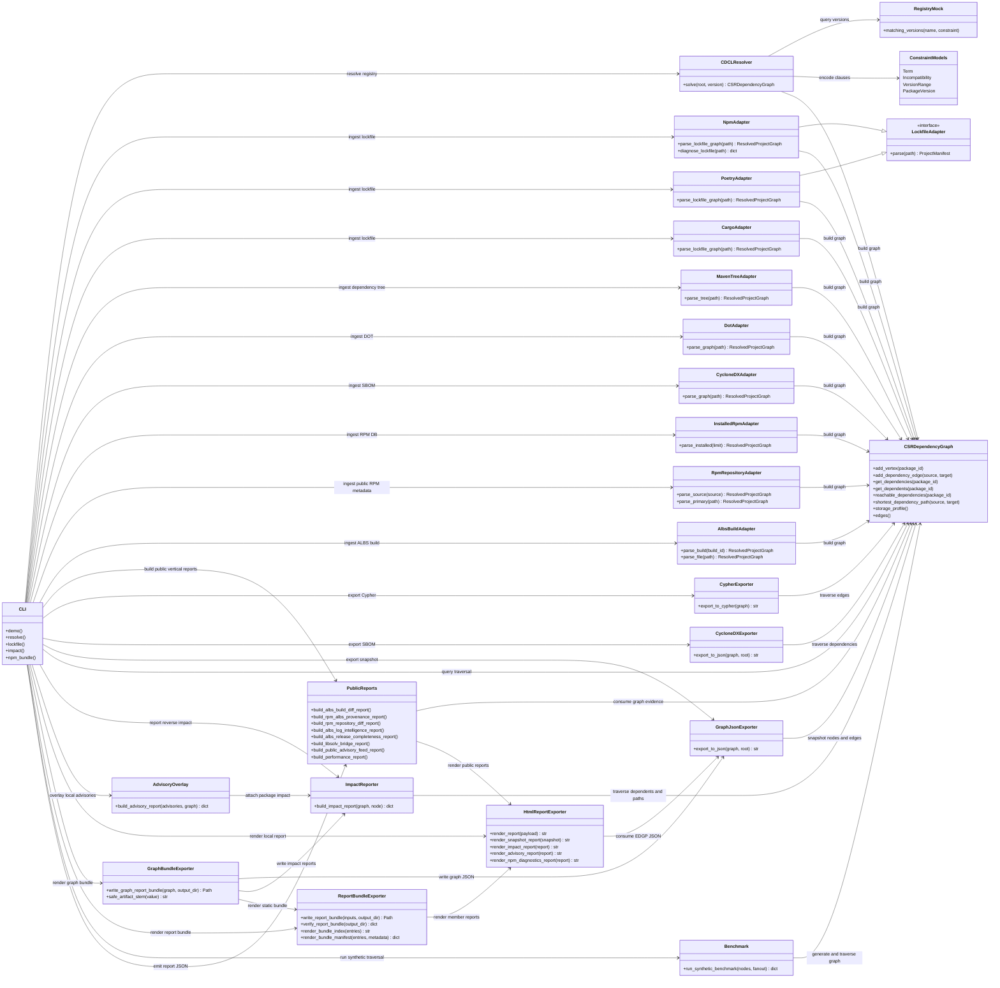
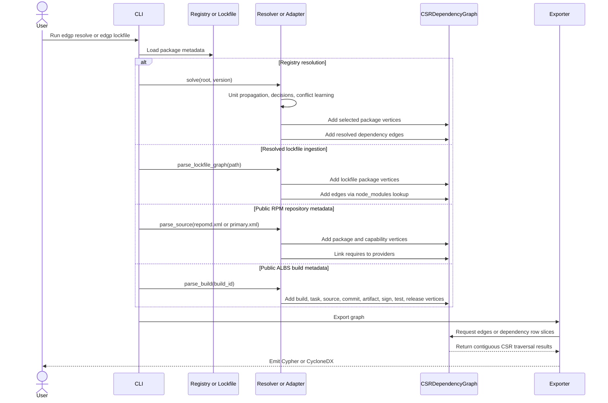

# Enterprise Dependency Graph Pipeline


Enterprise Dependency Graph Pipeline (EDGP) is a prototype for building,
resolving, storing, and exporting software dependency graphs at supply-chain
scale.

The design follows the research notes in this workspace:

- graph topology is represented with Compressed Sparse Row (CSR) arrays;
- dependency resolution uses a PubGrub/CDCL-inspired loop with learned
  incompatibilities;
- resolved graphs can be exported as Neo4j Cypher or CycloneDX SBOM JSON.

This is intentionally small enough to inspect, test, and extend. It is not a
drop-in replacement for mature package-manager solvers such as libsolv,
PubGrub, or Cargo, but it gives the project a concrete architecture for those
ideas.

## Core Capabilities

EDGP focuses on local, inspectable graph workflows:

- Build: ingest resolved dependency data from npm, Poetry, Cargo, Maven
  dependency trees, CycloneDX SBOMs, DOT/RPM graphs, bounded local RPM
  database snapshots, public RPM repository metadata, plus public ALBS build
  metadata.
- Analyze: query reachability, dependents, shortest paths,
  most-depended-upon packages, npm path conflicts, advisory overlays, and
  reverse impact. Public RPM reports summarize and compare repository
  snapshots. Public ALBS reports compare builds, summarize release coverage,
  extract log signals, and join installed RPMs back to build artifacts.
- Export: emit deterministic EDGP JSON, CycloneDX, Neo4j Cypher, static HTML
  reports, report bundles, and bundle verification manifests.
- Validate: run smoke checks from the installed project environment, schema
  validation, bundle verification, libsolv bridge checks, and synthetic CSR
  traversal benchmarks.

## Repository Layout

```text
src/
  adapters/        Manifest readers for ecosystems such as npm and Poetry
  core_graph/      CSR dependency graph implementation
  models/          Package, version, and incompatibility models
  output/          Cypher and CycloneDX exporters
  resolver/        CDCL-inspired resolver and mock registry
tests/
  fixtures/        Small registry and manifest examples
```

## Quick Start

### Install And Validate

```bash
python -m venv .venv
source .venv/bin/activate
python -m pip install -e ".[dev]"
pytest
```

```bash
python -B scripts/smoke_validate.py
python -B scripts/smoke_validate.py --include-rpm-installed
```

### Build Graphs

Start with the demo resolver, then ingest real resolved dependency inputs:

```bash
edgp demo --format cypher
edgp demo --format cyclonedx
edgp lockfile --path package-lock.json --format cypher
edgp lockfile --path package-lock.json --format cyclonedx
edgp lockfile --path package-lock.json --format json
```

Use ecosystem-specific adapters when the input format is already resolved:

```bash
edgp lockfile --ecosystem poetry --path poetry.lock --format json
edgp lockfile --ecosystem cargo --path Cargo.lock --format json
mvn dependency:tree -DoutputFile=maven-tree.txt
edgp maven-tree --path maven-tree.txt --format json
```

SBOM, DOT/RPM, and installed RPM sources are supported for system-oriented
investigation. Use bounded limits for local RPM database exploration, or fetch
public ALBS build metadata by build ID.

```bash
edgp sbom --path bom.json --format json
edgp dot --path repograph.dot --ecosystem rpm --format json
edgp dot --path repograph.dot --ecosystem rpm --format cyclonedx
edgp rpm-installed --limit 100 --max-requirements 40 --format json
edgp rpm-repo --source https://repo.almalinux.org/almalinux/10/BaseOS/x86_64/os/ --repo-id alma-baseos --format json
edgp rpm-repo-summary --source repodata/repomd.xml
edgp rpm-repo-summary-bundle --source repodata/repomd.xml --output-dir reports/rpm-repo-summary --triage-summary
edgp rpm-repo-diff --left-source old/repodata/repomd.xml --right-source new/repodata/repomd.xml
edgp rpm-repo-bundle --source repodata/repomd.xml --output-dir reports/rpm-repo --impact-node glibc --advisories advisories.json --public-advisory-feed osv.json --libsolv-transaction solver-transaction.txt --license-report --triage-summary
edgp albs-build --build-id 17812 --format json
edgp albs-artifact-inventory --build-id 17812
edgp albs-artifact-inventory-bundle --build-id 17812 --output-dir reports/albs-artifact-inventory --triage-summary
edgp albs-build-timing --build-id 17812
edgp albs-build-timing-bundle --build-id 17812 --output-dir reports/albs-build-timing --triage-summary
edgp albs-build-diff --left-build-id 17812 --right-build-id 17813
edgp albs-build-diff-bundle --left-build-id 17812 --right-build-id 17813 --output-dir reports/albs-build-diff --triage-summary
edgp albs-release-completeness --build-id 17812 --build-id 17813
edgp albs-log-intelligence --build-id 17813
edgp albs-log-intelligence-bundle --build-id 17813 --output-dir reports/albs-log-intelligence --triage-summary
edgp albs-release-completeness-bundle --build-id 17812 --build-id 17813 --output-dir reports/albs-release-completeness --triage-summary
edgp rpm-albs-provenance --build-id 17812 --rpm-limit 200
edgp rpm-albs-provenance-bundle --build-id 17812 --rpm-limit 200 --output-dir reports/rpm-albs-provenance --triage-summary
edgp libsolv-bridge --transaction solver-transaction.txt
edgp libsolv-bridge --transaction solver-transaction.txt --graph-snapshot rpm-repo-graph.json
edgp libsolv-bundle --transaction solver-transaction.txt --graph-snapshot rpm-repo-graph.json --output-dir reports/libsolv
edgp public-advisory-feed --path osv.json --ecosystem rpm
edgp public-advisory-feed --url https://example.com/osv.json --ecosystem rpm
edgp public-advisory-feed-bundle --path osv.json --ecosystem rpm --output-dir reports/public-advisory-feed --triage-summary
```

### Query And Analyze

Use the same traversal layer across lockfiles, SBOMs, DOT graphs, and local RPM
snapshots:

```bash
edgp query --path package-lock.json --operation reachable --node app==1.0.0
edgp query --path package-lock.json --operation path --node app==1.0.0 --target library==2.0.0
edgp query --source dot --path repograph.dot --ecosystem rpm --operation dependents --node glibc
edgp query --source rpm-repo --rpm-repo-source https://repo.almalinux.org/almalinux/10/BaseOS/x86_64/os/ --operation most-depended-upon
edgp query --source rpm-installed --rpm-limit 100 --max-requirements 40 --operation most-depended-upon
```

Impact, advisory overlays, and npm diagnostics cover the main triage flows:

```bash
edgp impact --path package-lock.json --node left-pad
edgp impact --source rpm-repo --path repodata/repomd.xml --node glibc
edgp impact-bundle --path package-lock.json --node left-pad --output-dir reports/impact --triage-summary
edgp advisory --path package-lock.json --advisories advisories.json
edgp advisory --source rpm-repo --path repodata/repomd.xml --advisories advisories.json --ecosystem rpm
edgp advisory --source rpm-repo --path repodata/repomd.xml --public-advisory-feed-url https://example.com/osv.json --ecosystem rpm
edgp advisory --source rpm-repo --path repodata/repomd.xml --public-advisory-feed osv.json --ecosystem rpm --fail-on-findings --fail-min-severity high
edgp advisory-bundle --source rpm-repo --path repodata/repomd.xml --public-advisory-feed osv.json --ecosystem rpm --output-dir reports/advisory --triage-summary
edgp license-report --source sbom --path bom.json --deny-license GPL-3.0-only --fail-on-denied
edgp license-report-bundle --source sbom --path bom.json --deny-license GPL-3.0-only --output-dir reports/license --triage-summary
edgp npm-diagnostics --path package-lock.json
edgp npm-diagnostics-bundle --path package-lock.json --output-dir reports/npm-diagnostics --triage-summary
edgp diff --left before.json --right after.json
edgp diff-bundle --left before.json --right after.json --output-dir reports/graph-diff --triage-summary
```

### Reports And Bundles

Generate browser-friendly reports and verifiable static bundles:

```bash
edgp npm-bundle --path package-lock.json --impact-node left-pad --advisories advisories.json --deny-license GPL-3.0-only --output-dir reports/npm --fail-on-status fail
edgp maven-bundle --path maven-tree.txt --output-dir reports/maven
edgp dot-bundle --path repograph.dot --ecosystem rpm --impact-node glibc --output-dir reports/rpm-dot
edgp sbom-bundle --path bom.json --impact-node left-pad --deny-license WTFPL --fail-on-denied --output-dir reports/sbom
edgp rpm-installed-bundle --limit 100 --max-requirements 40 --impact-node rpm-installed==local --advisories advisories.json --public-advisory-feed osv.json --albs-build-id 17812 --libsolv-transaction solver-transaction.txt --license-report --output-dir reports/rpm-installed --triage-summary
edgp rpm-repo-diff-bundle --left-source old/repodata/repomd.xml --right-source new/repodata/repomd.xml --output-dir reports/rpm-repo-diff
edgp albs-build-bundle --build-id 17812 --impact-node albs-release:7396 --output-dir reports/albs
edgp libsolv-bundle --transaction solver-transaction.txt --graph-snapshot rpm-repo-graph.json --output-dir reports/libsolv
edgp report --snapshot graph.json --output graph-report.html
edgp report-bundle --input graph.json --input impact.json --output-dir reports --fail-on-status fail
edgp verify-bundle --path reports
edgp triage-summary --bundle reports --fail-on-status fail
edgp validate --path graph.json
edgp validate --path reports --format text
```

### Benchmark

```bash
edgp benchmark --nodes 1000 --fanout 3
edgp performance-report --scenario 1000:3 --scenario 10000:5
edgp performance-report-bundle --scenario 1000:3 --scenario 10000:5 --output-dir reports/performance --triage-summary
```

## Architecture

### Architecture UML



### Graph Build And Traversal UML



### CSR Graph Core

`CSRDependencyGraph` stores nodes in integer maps and materializes directed
edges into three C-contiguous NumPy `int32` arrays:

- `values`: relationship type identifiers;
- `column_indices`: destination vertex ids;
- `row_pointers`: offsets into `column_indices` for each source vertex.

This is an intentional productionization step. Native Python lists would store
boxed integers behind arrays of object pointers. Even when the list container is
contiguous, traversal still chases pointers to scattered Python objects, which
hurts spatial locality and defeats much of the hardware cache prefetch behavior
that makes CSR powerful. NumPy `int32` arrays store unboxed integers in one
C-contiguous memory region, reducing pointer chasing, improving cache-line
utilization, and keeping row-slice scans close to the memory layout used by C
and Fortran graph kernels.

The decision also lines up with Python 3.14 free-threaded (`3.14t`) deployment.
Historically, Python's Global Interpreter Lock limited parallel graph traversal
from pure Python workers. With a free-threaded build, EDGP can pursue
multi-core reachability over these contiguous NumPy arrays using native Python
threading. That gives us enterprise-grade performance without the overhead of
maintaining a separate Rust or C++ extension. The current benchmark output
includes the CSR storage profile (`numpy.int32.c_contiguous`, byte counts, and
contiguity flag) so this assumption is visible in smoke runs.

### CDCL-Inspired Resolution

The resolver translates registry metadata into Conjunctive Normal Form
(CNF)-style incompatibilities for SAT-style propagation:

- a root package clause requiring the selected root;
- at-most-one-version clauses per package;
- dependency clauses of the form `not source OR allowed_dependency_version...`.

The operational loop performs unit propagation, makes dependency decisions,
learns a blocking incompatibility from conflicts, and backtracks before trying
the next viable package version.

### Lockfile Ingestion

`NpmAdapter.parse_lockfile_graph` turns npm `package-lock.json` files into the
same CSR graph used by the resolver. For lockfile v2/v3 it walks the `packages`
map, derives package names from `node_modules` paths when metadata omits them,
and resolves dependencies through npm's nested `node_modules` lookup rules.
Legacy v1 dependency trees are supported with recursive edge extraction.

`PoetryAdapter.parse_lockfile_graph` turns `poetry.lock` package sections into a
PyPI CSR graph. It links package dependency tables to locked package versions,
adds a synthetic `poetry-lock==resolved` root for top-level packages, and carries
Poetry metadata such as groups, optional flags, and Python version constraints.

`CargoAdapter.parse_lockfile_graph` turns `Cargo.lock` package sections into a
Rust crate CSR graph. It resolves dependency strings by package name and version
when present, adds a synthetic `cargo-lock==resolved` root, and carries Cargo
metadata such as registry source and checksum.

`MavenTreeAdapter.parse_tree` turns `mvn dependency:tree` text output into a
Maven CSR graph. It uses the visible tree prefixes to preserve parent-child
relationships and stores group id, artifact id, packaging, classifier, and scope
metadata when present. Classifier-bearing and non-jar artifacts are
disambiguated in EDGP node ids, for example
`com.example:native-lib:linux-x86_64==1.0.0` or
`com.example:platform:pom==1.0.0`, while standard jar artifacts keep the compact
`group:artifact==version` form. When verbose dependency-tree output includes
public markers such as `(optional)` or `- omitted for conflict with ...`, EDGP
preserves them as Maven node metadata and relationship types in exported edges:
`1` for ordinary dependencies, `2` for optional entries, `3` for omitted
entries, and `4` for excluded entries when present in text output.

`edgp maven-bundle` renders a Maven dependency-tree graph into a static local
bundle with `maven-graph.json`, optional impact reports, HTML, `index.html`, and
`manifest.json`. The manifest records `bundle.sourceKind` as
`maven-dependency-tree` and includes the generating command.

`edgp dot-bundle` renders DOT graphs, including `dnf repograph`-style RPM
graphs, into static local bundles with `dot-graph.json`, optional impact reports,
HTML, `index.html`, and `manifest.json`. The manifest records `bundle.sourceKind`
as `dot` and includes the generating command.

`edgp rpm-repo` parses public RPM `primary.xml` or `primary.xml.gz` repository
metadata, local or remote `repomd.xml`, or a repository base URL and builds an
RPM universe graph from package, provides, and requires records. Resolved
requirements point at provider packages; unresolved requirements become
explicit capability nodes. `edgp rpm-repo-summary` reports package counts,
source RPM concentration, architecture coverage, and unresolved requirements.
`edgp rpm-repo-summary-bundle` renders that coverage summary as static HTML
with a verifiable manifest.
`edgp rpm-repo-diff` compares two repository snapshots by package name and
architecture, surfacing added, removed, and changed EVR/source-RPM records.
`edgp rpm-repo-diff-bundle` renders that comparison as a static HTML bundle
with a verifiable manifest for browser review.
The same repository input can also feed `edgp query`, `edgp impact`, and
`edgp advisory` via `--source rpm-repo`, which makes public repo metadata usable
in the generic traversal and advisory workflows.
`edgp rpm-repo-bundle` writes the graph, summary, optional impact reports, local
advisory overlays, normalized public advisory feed reports, optional
graph-matched libsolv transaction reports, static HTML, and a verification
manifest. This is the public-resource path toward
distribution-scale graph size without private repositories.

`edgp sbom-bundle` renders CycloneDX JSON SBOMs into static local bundles with
`sbom-graph.json`, optional impact reports, HTML, `index.html`, and
`manifest.json`. The manifest records `bundle.sourceKind` as `cyclonedx-sbom`
and includes the generating command.

`edgp rpm-installed-bundle` renders a bounded local RPM database graph on hosts
with an RPM database into a static bundle with `rpm-installed-graph.json`,
optional impact reports, local advisory overlays, normalized public advisory
feed reports, optional installed-RPM to public ALBS artifact provenance,
optional graph-matched libsolv transaction reports, HTML, `index.html`, and
`manifest.json`. The manifest records `bundle.sourceKind` as `rpm-installed`
and includes the generating command.

`edgp albs-build` fetches public ALBS build metadata by build ID or reads an
ALBS JSON file and turns source package, repository, commit, build task,
environment, RPM artifact, sign task, test task, and release records into the
same CSR snapshot format. `edgp albs-artifact-inventory` emits a build-output
inventory grouped by architecture and package. `edgp albs-build-timing` emits
task, sign, and artifact timing derived from the same ALBS metadata. The
standalone `albs-artifact-inventory-bundle` and `albs-build-timing-bundle`
commands render those focused views as static, verifiable report bundles.
`edgp albs-build-bundle` renders that real build provenance graph into a static
bundle with `albs-build-graph.json`, `albs-artifact-inventory.json`,
`albs-build-timing.json`, optional impact reports, HTML, `index.html`, and
`manifest.json`. The manifest records `bundle.sourceKind` as `albs-build` and
includes the generating command.

The public ALBS/report layer adds investigation views that do not need private
resources:

- `edgp albs-build-diff` compares two builds for artifact, source commit, and
  timing changes. `edgp albs-build-diff-bundle` renders the same comparison as
  static HTML with `manifest.json` for review and verification.
- `edgp rpm-albs-provenance` joins installed RPMs from the local RPM database to
  artifacts from one public ALBS build. `edgp rpm-albs-provenance-bundle`
  renders that join as static HTML with `manifest.json` for browser review and
  bundle verification.
- `edgp albs-log-intelligence` extracts warning/error/failure signals from
  inline build-log metadata when present. `edgp albs-log-intelligence-bundle`
  renders those signals as static HTML with a verifiable manifest.
- `edgp albs-release-completeness` summarizes release, architecture, sign, and
  test coverage across a batch of public builds. `edgp
  albs-release-completeness-bundle` renders that release coverage as static
  HTML with a verifiable manifest.
- `edgp public-advisory-feed` normalizes OSV-like public advisory payloads from
  local JSON files or URLs into EDGP advisory overlays. `edgp
  public-advisory-feed-bundle` renders that normalization as static HTML with a
  verifiable manifest; RPM repository bundles can include the same feed and a
  graph-matched advisory impact report in one review artifact. Normalization
  preserves explicit OSV `versions` and simple `ranges.events` intervals using
  inclusive `introduced`, exclusive `fixed`/`limit`, and inclusive
  `lastAffected` bounds for report matching.
- `edgp libsolv-bridge` reports local libsolv command availability and parses
  transaction transcripts so EDGP can explain solved RPM actions while leaving
  SAT solving to libsolv. Parsed actions are normalized into RPM package
  metadata, EDGP graph `nodeId` values, and Package URLs. With
  `--graph-snapshot`, the bridge also matches those solved package identities
  against an existing EDGP snapshot and reports exact, candidate, and unmatched
  graph actions.
- `edgp performance-report` runs deterministic NumPy-backed CSR benchmark
  scenarios and records storage layout evidence. `edgp
  performance-report-bundle` renders those measurements as static HTML with a
  verifiable manifest.

### Graph and Security Egress

`CypherExporter` emits deterministic Neo4j statements for package nodes and
`DEPENDS_ON` relationships. `CycloneDXExporter` emits a CycloneDX-compatible
JSON SBOM with dependency references, suitable as the foundation for
Dependency-Track or similar security ingestion paths. npm lockfile exports use
ecosystem-aware Package URLs, such as `pkg:npm/%40scope/tool@2.1.0`, and carry
lockfile metadata like resolved tarball URLs, integrity strings, license names,
and package paths as CycloneDX fields or properties. RPM/DOT exports use RPM
Package URLs such as `pkg:rpm/glibc@unknown` and can include RPM qualifiers when
metadata such as `arch`, `distro`, or non-zero `epoch` is available. Live
`rpm-installed` ingestion also records public RPM metadata such as vendor,
license, source RPM, install time, architecture, distribution, packager,
upstream URL, and build host when those fields are present in the RPM database.

### Query Layer

CSR traversal supports immediate dependencies, immediate dependents, forward and
reverse reachability, shortest dependency paths, and most-depended-upon ranking.
The CLI exposes these operations as JSON through `edgp query`, which makes the
same graph useful for terminal investigation, future UI panels, and RAG context
generation. Query selectors accept exact package IDs, such as
`glibc==2.39-1.el10`, or unambiguous package names, such as `glibc`.

`edgp npm-diagnostics` inspects `package-lock.json` resolution paths and reports
duplicate package names, nested version conflicts, and unresolved dependency
declarations. `edgp npm-diagnostics-bundle` renders that diagnosis as static
HTML with a verifiable manifest. This helps explain why npm consumers may reach
different versions of the same package through nested `node_modules` paths.

`edgp npm-bundle` turns one `package-lock.json` into a local static triage
folder containing `npm-graph.json`, `npm-diagnostics.json`, optional impact and
advisory JSON reports, HTML reports, `index.html`, and `manifest.json`. It is
the fastest public-resource path from an npm lockfile to a browser-friendly
graph, diagnostics, and local advisory view. The manifest records
`bundle.sourceKind` as `npm-lockfile` and includes the generating command.
Passing `--triage-summary` adds a generated bundle-level triage rollup to the
same static directory.

`edgp impact` turns reverse reachability into a vulnerability-style impact
report. For a selected node it returns direct dependents, all transitive
affected dependents, and shortest dependency chains back to the selected
component. `edgp impact-bundle` renders the same analysis as static HTML with a
verifiable manifest. This is the public-input stand-in for future advisory or
curated risk feeds.

`edgp diff` compares two EDGP graph snapshots and reports added or removed
nodes, added or removed edges, and node metadata changes. `edgp diff-bundle`
renders that generic snapshot comparison as static HTML with a verifiable
manifest, which makes before/after graph changes shareable without rebuilding
the original input adapters.

`edgp advisory` accepts either a small local JSON overlay with `id`, `package`,
optional `versions`, `ranges`, `severity`, `summary`, `references`, and `purl`
fields, or a public OSV-like advisory feed from `--public-advisory-feed` or
`--public-advisory-feed-url`. It matches those records against graph nodes and
embeds an `edgp.impact.report.v1` result for every matched package. Public
SBOM/advisory workflows can identify components by Package URL (`purl`); EDGP
compares exact PURLs and their qualifier-free form before falling back to
package-name and version matching. For RPM graphs, `versions` may use the full
node version, the RPM `version-release` EVR without architecture, or
`epoch:version-release` when epoch is non-zero. `ranges` support simple
OSV-style bounds for public feed impact reporting;
`--fail-on-findings` still prints the full JSON report and exits with status `2`
when matched findings exist. `--fail-min-severity` can raise that gate to
`low`, `medium`, `high`, or `critical` while leaving the report unfiltered.
Severity gates understand both those labels and numeric CVSS-style scores such
as `9.8`. `edgp advisory-bundle` writes the same advisory analysis as static
HTML with a verifiable manifest and preserves the bundle before returning
status `2` for `--fail-on-findings`.
libsolv remains the production authority for RPM SAT solving and transaction
decisions.
`edgp libsolv-bridge --transaction ...` normalizes saved solver output into
action rows with RPM name/version/release/arch fields, old/new node IDs for
upgrades, and RPM Package URLs. That makes the bridge useful even on public
infrastructure without invoking a private resolver: libsolv can decide the
transaction, while EDGP can attach those solved package identities to CSR graph
snapshots, bundle reports, and later blast-radius traversal. Passing
`--graph-snapshot` enriches each transaction action with graph match status,
matched node IDs, and dependent counts from an existing EDGP graph snapshot.
It also emits a flat `transactionImpact` rollup sorted by affected dependents,
so browser reports and CI/workbench consumers can see the highest-impact solver
actions without unpacking nested match records.
`edgp libsolv-bundle` writes the same bridge report into a static, verifiable
HTML bundle with `manifest.json`, so a saved solver transaction can be reviewed
in the browser or attached to a CI/workbench artifact set.

`edgp license-report` summarizes license metadata from any supported graph
source and optionally checks a deny-list. `--deny-license` may be repeated; EDGP
matches exact license strings and simple SPDX-expression tokens, emits the full
`edgp.license.report.v1` JSON report, and exits with status `2` when
`--fail-on-denied` finds a denied license. This works with public CycloneDX
SBOMs, lockfile-derived metadata, public RPM repository metadata, and installed
RPM metadata when licenses are visible in the source. `edgp
license-report-bundle` writes the same license report as static HTML with a
verifiable manifest and preserves the bundle before returning status `2` for
`--fail-on-denied`.
Graph bundle commands for npm lockfiles, CycloneDX SBOMs, public RPM
repositories, and installed RPM databases can also include the same report with
`--license-report`; passing `--deny-license` to a bundle command includes the
license report automatically. Adding `--fail-on-denied` preserves the generated
bundle artifacts and returns status `2` when denied licenses are present.
Graph bundle commands also accept `--triage-summary` to write and link
`triage-summary.json` and `triage-summary.html` beside the original reports.
Passing `--fail-on-status warn|fail` implies `--triage-summary`, preserves the
generated bundle artifacts, prints the bundle index path, and returns status `2`
when the generated rollup reaches the selected threshold.

`edgp benchmark` builds a deterministic synthetic CSR graph and reports build,
reachable traversal, and most-depended-upon timings. It is intended as a
small smoke benchmark for comparing host environments.

### JSON Snapshot

`GraphJsonExporter` emits `edgp.graph.snapshot.v1`, a deterministic graph JSON
document with root, ecosystem, node metadata, direct dependencies, direct
dependents, edge records, graph stats, and most-depended-upon rankings. This is
the plain interchange format for notebooks, local workbench panels, and RAG
context generation.
The architecture and traversal research behind these graph-building choices is
summarized in
[`docs/Architecture and Traversal of Massive-Scale Dependency Graphs.md`](docs/Architecture%20and%20Traversal%20of%20Massive-Scale%20Dependency%20Graphs.md),
especially the sections on
[memory representation](docs/Architecture%20and%20Traversal%20of%20Massive-Scale%20Dependency%20Graphs.md#memory-optimization-and-sparse-matrix-representations)
and
[dependency graph resolution](docs/Architecture%20and%20Traversal%20of%20Massive-Scale%20Dependency%20Graphs.md#algorithmic-resolution-of-software-dependency-graphs).
Report JSON contracts for graph snapshots, impact reports, advisory reports,
and npm diagnostics are documented in
[`docs/Report JSON Schemas.md`](docs/Report%20JSON%20Schemas.md), with
machine-readable Draft 2020-12 schemas in [`docs/schemas`](docs/schemas).
`edgp validate` checks a local EDGP JSON report file against the documented
schema subset or validates a report bundle directory with the bundle verifier.
For bundles that already contain `manifest.triageSummary`, `validate
--fail-on-status warn|fail` also gates on the generated triage status while
leaving validation itself read-only.
Validation failure examples are documented in
[`docs/Validation Failure Examples.md`](docs/Validation%20Failure%20Examples.md).
Start with the guide's
[`CLI Index Workflows`](docs/Validation%20Failure%20Examples.md#cli-index-workflows)
or [`Quick Links`](docs/Validation%20Failure%20Examples.md#quick-links)
when looking up a failure by ID, contract, artifact type, or code.
The machine-readable example index is committed at
[`docs/validation-failure-example-index.json`](docs/validation-failure-example-index.json)
and the filter listing fixture is committed at
[`docs/validation-failure-example-filters.json`](docs/validation-failure-example-filters.json).
Both can be emitted from the CLI:

```bash
edgp failure-examples
edgp failure-examples --format text
edgp failure-examples --list-codes
edgp failure-examples --contract edgp.graph.snapshot.v1 --format text
edgp failure-examples --target-type report-bundle --code manifestInvalid
```

`failure-examples` filters are composable:

| Switch | Filters by | Example |
| --- | --- | --- |
| `--id` | stable example ID | `manifest-invalid` |
| `--contract` | documented schema contract | `edgp.graph.snapshot.v1` |
| `--target-type` | artifact type | `json-file` |
| `--code` | validation or verifier failure code | `bundle.manifestInvalid` |
| `--list-codes` | available IDs, contracts, artifact types, and codes | `--list-codes` |

Common combinations:

```bash
edgp failure-examples --target-type report-bundle --contract edgp.report.bundle.v1 --list-codes
edgp failure-examples --target-type report-bundle --contract edgp.report.bundle.v1 --code manifestInvalid --format text
```

`scripts/browser_smoke_report_sorting.py` generates a self-checking HTML report
that exercises graph report table sorting inside a browser.
`scripts/browser_smoke_report_bundle_navigation.py` generates a self-checking
static report bundle that exercises index card links and member report loads in
a browser.

`edgp report` renders graph snapshots, impact reports, advisory reports, and npm
diagnostics into dependency-free HTML files. Snapshot reports include graph
metrics, a compact SVG preview, a filterable, windowed, and sortable edge
explorer, a sortable node metadata table, and most-depended-upon rankings. Graph
snapshot reports also summarize edge
relationship types, including Maven optional, omitted, and excluded
dependency-tree markers plus ALBS build/provenance edges. Impact and
advisory reports render affected package lists, dependency
chains, advisory metadata, and affected dependent counts for browser-friendly
triage. npm diagnostics reports render duplicate package names, nested
resolution conflicts, and unresolved dependency declarations.

`edgp report-bundle` renders multiple EDGP JSON documents into one static
directory with deterministic member report filenames, an `index.html` summary,
and a machine-readable `manifest.json`. This is a local, public-resource triage
surface for handing a graph snapshot plus related impact, advisory, or npm
diagnostic reports to a browser, RAG context builder, or future workbench UI.
The manifest records `bundle.sourceKind` as `edgp-json` and includes the
generating command. Each member report entry also records SHA-256 digests for
the source JSON and rendered HTML bytes, plus a top-level `bundleSha256`
fingerprint for the canonical manifest payload. The manifest contract is
documented in
[`docs/Report Bundle Manifest Schema.md`](docs/Report%20Bundle%20Manifest%20Schema.md),
with the machine-readable JSON Schema at
[`docs/schemas/edgp.report.bundle.v1.schema.json`](docs/schemas/edgp.report.bundle.v1.schema.json).
The committed schema catalog at
[`docs/schemas/index.json`](docs/schemas/index.json) is generated by
`scripts/generate_schema_index.py` and checked by smoke validation.
`edgp verify-bundle` checks that manifest shape, member artifact digests, and
the top-level bundle fingerprint still match the generated directory. It emits
JSON by default using the documented
`edgp.report.bundle.verification.v1` contract and supports `--format text` for
concise terminal checks. The verification report contract is documented in
[`docs/Report Bundle Verification Schema.md`](docs/Report%20Bundle%20Verification%20Schema.md),
with the machine-readable JSON Schema at
[`docs/schemas/edgp.report.bundle.verification.v1.schema.json`](docs/schemas/edgp.report.bundle.verification.v1.schema.json).
[`tests/fixtures/report-bundle-verification.json`](tests/fixtures/report-bundle-verification.json)
provides a normalized machine-readable example of the verification report.
The bundle `index.html` also includes a compact verification summary showing
report count, manifest schema, and a shortened bundle fingerprint.
With `--triage-summary`, `report-bundle` also writes `triage-summary.json` and
`triage-summary.html`, links the rollup from the bundle index, and records both
artifact digests in `manifest.triageSummary` without adding the generated
summary back into the input `reports` list.
`--fail-on-status warn|fail` applies the same artifact-preserving gate directly
to `report-bundle`.

`edgp triage-summary` turns a report bundle, or a list of EDGP JSON reports, into
one `edgp.triage.summary.v1` JSON rollup. It reports pass/warn/fail status,
graph size, advisory findings, denied license findings, npm diagnostic signals,
and the source report list so CI systems and workbench/RAG contexts can read one
compact artifact instead of stitching together every report manually.
`--fail-on-status warn|fail` still prints the JSON rollup and returns status `2`
when the computed status reaches the selected threshold.

## Roadmap

- deepen resolver conflict explanations toward full PubGrub semantics;
- harden ecosystem adapters with larger real-world fixture suites;
- support curated vulnerability annotations and reachability policies;
- add GraphBLAS or GPU-backed traversal adapters for very large static graphs;
- add batch Cypher, SBOM, and report-bundle submission clients for automated
  DevSecOps flows.
