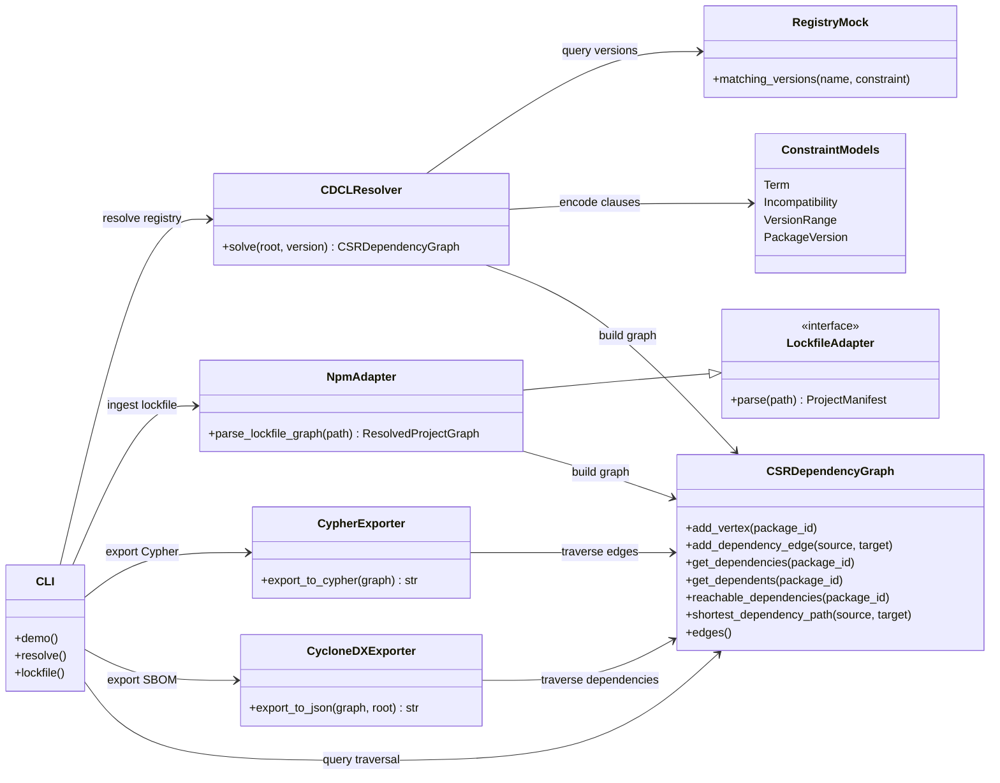
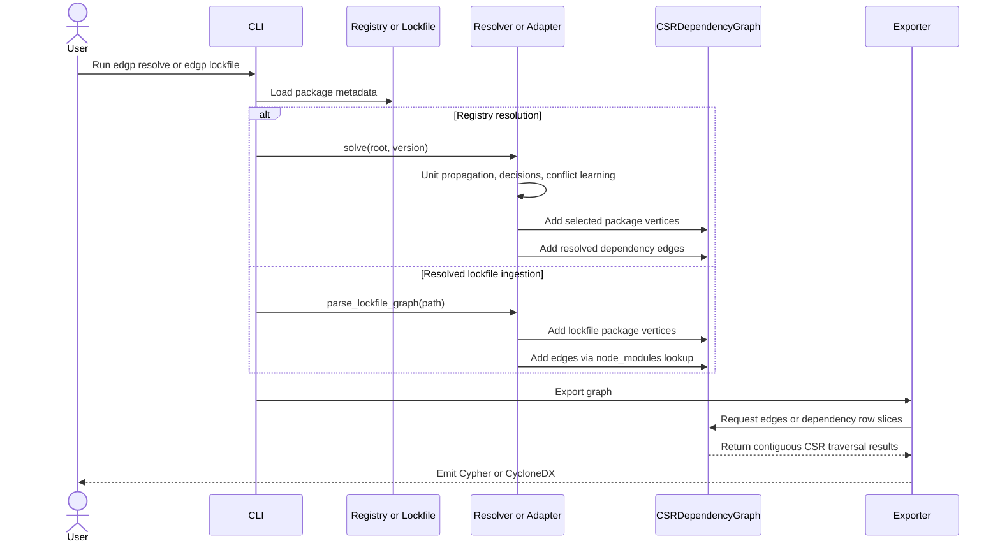

# Enterprise Dependency Graph Pipeline

Enterprise Dependency Graph Pipeline (EDGP) is a prototype for building,
resolving, storing, and exporting software dependency graphs at supply-chain
scale.

The design follows the research notes in this workspace:

- graph topology is represented with Compressed Sparse Row (CSR) arrays;
- dependency resolution uses a PubGrub/CDCL-inspired loop with learned
  incompatibilities;
- resolved graphs can be exported as Neo4j Cypher or CycloneDX SBOM JSON.

This is intentionally small enough to inspect, test, and extend. It is not a
drop-in replacement for mature package-manager solvers such as libsolv,
PubGrub, or Cargo, but it gives the project a concrete architecture for those
ideas.

## Repository Layout

```text
src/
  adapters/        Manifest readers for ecosystems such as npm and Poetry
  core_graph/      CSR dependency graph implementation
  models/          Package, version, and incompatibility models
  output/          Cypher and CycloneDX exporters
  resolver/        CDCL-inspired resolver and mock registry
tests/
  fixtures/        Small registry and manifest examples
```

## Quick Start

```bash
python -m venv .venv
source .venv/bin/activate
python -m pip install -e ".[dev]"
pytest
```

Run the demo resolver and export the result:

```bash
edgp demo --format cypher
edgp demo --format cyclonedx
```

Export an already-resolved npm lockfile:

```bash
edgp lockfile --path package-lock.json --format cypher
edgp lockfile --path package-lock.json --format cyclonedx
```

Query an already-resolved npm lockfile:

```bash
edgp query --path package-lock.json --operation reachable --node app==1.0.0
edgp query --path package-lock.json --operation path --node app==1.0.0 --target library==2.0.0
edgp query --path package-lock.json --operation most-depended-upon --limit 20
```

## Architecture

### Architecture UML



### Graph Build And Traversal UML



### CSR Graph Core

`CSRDependencyGraph` stores nodes in integer maps and materializes directed
edges into three contiguous arrays:

- `values`: relationship type identifiers;
- `column_indices`: destination vertex ids;
- `row_pointers`: offsets into `column_indices` for each source vertex.

This keeps graph traversal cache-friendly and makes the output layer independent
of nested Python object graphs.

### CDCL-Inspired Resolution

The resolver translates registry metadata into Conjunctive Normal Form
(CNF)-style incompatibilities for SAT-style propagation:

- a root package clause requiring the selected root;
- at-most-one-version clauses per package;
- dependency clauses of the form `not source OR allowed_dependency_version...`.

The operational loop performs unit propagation, makes dependency decisions,
learns a blocking incompatibility from conflicts, and backtracks before trying
the next viable package version.

### Lockfile Ingestion

`NpmAdapter.parse_lockfile_graph` turns npm `package-lock.json` files into the
same CSR graph used by the resolver. For lockfile v2/v3 it walks the `packages`
map, derives package names from `node_modules` paths when metadata omits them,
and resolves dependencies through npm's nested `node_modules` lookup rules.
Legacy v1 dependency trees are supported with recursive edge extraction.

### Graph and Security Egress

`CypherExporter` emits deterministic Neo4j statements for package nodes and
`DEPENDS_ON` relationships. `CycloneDXExporter` emits a CycloneDX-compatible
JSON SBOM with dependency references, suitable as the foundation for
Dependency-Track or similar security ingestion paths. npm lockfile exports use
ecosystem-aware Package URLs, such as `pkg:npm/%40scope/tool@2.1.0`, and carry
lockfile metadata like resolved tarball URLs, integrity strings, license names,
and package paths as CycloneDX fields or properties.

### Query Layer

CSR traversal supports immediate dependencies, immediate dependents, forward and
reverse reachability, shortest dependency paths, and most-depended-upon ranking.
The CLI exposes these operations as JSON through `edgp query`, which makes the
same graph useful for terminal investigation, future UI panels, and RAG context
generation.

## Roadmap

- replace the prototype learner with full PubGrub conflict explanation;
- add native lockfile graph extraction for Poetry, Cargo, and Maven;
- support vulnerability annotations and reachability queries;
- add GraphBLAS or GPU-backed traversal adapters for very large static graphs;
- add batch Cypher and SBOM submission clients for automated DevSecOps flows.
