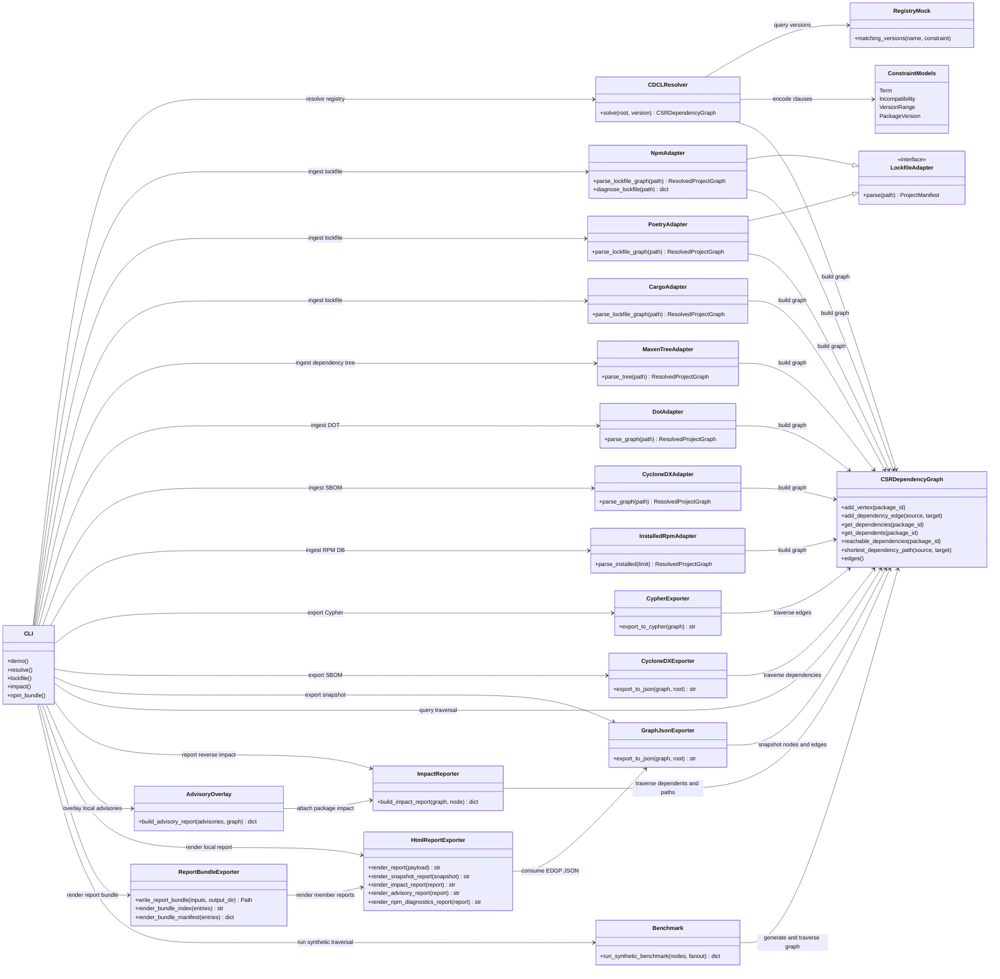
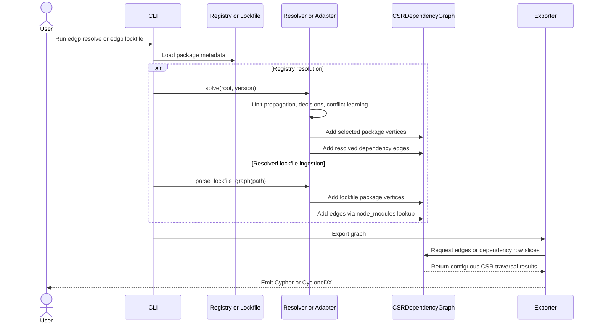

# Enterprise Dependency Graph Pipeline

Enterprise Dependency Graph Pipeline (EDGP) is a prototype for building,
resolving, storing, and exporting software dependency graphs at supply-chain
scale.

The design follows the research notes in this workspace:

- graph topology is represented with Compressed Sparse Row (CSR) arrays;
- dependency resolution uses a PubGrub/CDCL-inspired loop with learned
  incompatibilities;
- resolved graphs can be exported as Neo4j Cypher or CycloneDX SBOM JSON.

This is intentionally small enough to inspect, test, and extend. It is not a
drop-in replacement for mature package-manager solvers such as libsolv,
PubGrub, or Cargo, but it gives the project a concrete architecture for those
ideas.

## Repository Layout

```text
src/
  adapters/        Manifest readers for ecosystems such as npm and Poetry
  core_graph/      CSR dependency graph implementation
  models/          Package, version, and incompatibility models
  output/          Cypher and CycloneDX exporters
  resolver/        CDCL-inspired resolver and mock registry
tests/
  fixtures/        Small registry and manifest examples
```

## Quick Start

```bash
python -m venv .venv
source .venv/bin/activate
python -m pip install -e ".[dev]"
pytest
```

Run dependency-free smoke validation:

```bash
python -B scripts/smoke_validate.py
python -B scripts/smoke_validate.py --include-rpm-installed
```

Run the demo resolver and export the result:

```bash
edgp demo --format cypher
edgp demo --format cyclonedx
```

Export an already-resolved npm lockfile:

```bash
edgp lockfile --path package-lock.json --format cypher
edgp lockfile --path package-lock.json --format cyclonedx
edgp lockfile --path package-lock.json --format json
```

Export an already-resolved Poetry lockfile:

```bash
edgp lockfile --ecosystem poetry --path poetry.lock --format json
edgp lockfile --ecosystem poetry --path poetry.lock --format cyclonedx
```

Export an already-resolved Cargo lockfile:

```bash
edgp lockfile --ecosystem cargo --path Cargo.lock --format json
edgp lockfile --ecosystem cargo --path Cargo.lock --format cyclonedx
```

Export a Maven dependency tree:

```bash
mvn dependency:tree -DoutputFile=maven-tree.txt
edgp maven-tree --path maven-tree.txt --format json
edgp maven-tree --path maven-tree.txt --format cyclonedx
edgp maven-bundle --path maven-tree.txt --output-dir reports/maven
```

Query an already-resolved npm lockfile:

```bash
edgp query --path package-lock.json --operation reachable --node app==1.0.0
edgp query --path package-lock.json --operation path --node app==1.0.0 --target library==2.0.0
edgp query --path package-lock.json --operation most-depended-upon --limit 20
```

Diagnose npm dependency path conflicts:

```bash
edgp npm-diagnostics --path package-lock.json
edgp npm-bundle --path package-lock.json --output-dir reports/npm
edgp npm-bundle --path package-lock.json --impact-node left-pad --advisories advisories.json --output-dir reports/npm
```

Report reverse dependency impact for a package:

```bash
edgp impact --path package-lock.json --node left-pad
edgp impact --source dot --path repograph.dot --ecosystem rpm --node glibc
edgp impact --source rpm-installed --node glibc --rpm-limit 100 --max-requirements 40
```

Overlay local advisory JSON and include impact for matched packages:

```bash
edgp advisory --path package-lock.json --advisories advisories.json
edgp advisory --source rpm-installed --advisories advisories.json --rpm-limit 100
```

Export an AlmaLinux/RPM universe graph from DOT:

```bash
edgp dot --path repograph.dot --ecosystem rpm --format json
edgp dot --path repograph.dot --ecosystem rpm --format cypher
edgp dot --path repograph.dot --ecosystem rpm --format cyclonedx
edgp query --source dot --path repograph.dot --ecosystem rpm --operation dependents --node glibc
edgp dot-bundle --path repograph.dot --ecosystem rpm --impact-node glibc --output-dir reports/rpm-dot
```

Export a bounded graph from the local RPM database on AlmaLinux:

```bash
edgp rpm-installed --limit 100 --max-requirements 40 --format json
edgp rpm-installed --limit 100 --max-requirements 40 --format cyclonedx
edgp query --source rpm-installed --rpm-limit 100 --max-requirements 40 --operation most-depended-upon
```

Import and re-export a CycloneDX JSON SBOM:

```bash
edgp sbom --path bom.json --format json
edgp query --source sbom --path bom.json --operation reachable --node app
```

Diff two EDGP JSON snapshots:

```bash
edgp diff --left before.json --right after.json
```

Render static HTML reports from EDGP JSON documents:

```bash
edgp report --snapshot graph.json --output graph-report.html
edgp report --input impact.json --output impact-report.html
edgp report --input advisory.json --output advisory-report.html
edgp report --input npm-diagnostics.json --output npm-diagnostics-report.html
edgp report-bundle --input graph.json --input impact.json --output-dir reports
```

Run a synthetic CSR traversal benchmark:

```bash
edgp benchmark --nodes 1000 --fanout 3
```

## Architecture

### Architecture UML



### Graph Build And Traversal UML



### CSR Graph Core

`CSRDependencyGraph` stores nodes in integer maps and materializes directed
edges into three contiguous arrays:

- `values`: relationship type identifiers;
- `column_indices`: destination vertex ids;
- `row_pointers`: offsets into `column_indices` for each source vertex.

This keeps graph traversal cache-friendly and makes the output layer independent
of nested Python object graphs.

### CDCL-Inspired Resolution

The resolver translates registry metadata into Conjunctive Normal Form
(CNF)-style incompatibilities for SAT-style propagation:

- a root package clause requiring the selected root;
- at-most-one-version clauses per package;
- dependency clauses of the form `not source OR allowed_dependency_version...`.

The operational loop performs unit propagation, makes dependency decisions,
learns a blocking incompatibility from conflicts, and backtracks before trying
the next viable package version.

### Lockfile Ingestion

`NpmAdapter.parse_lockfile_graph` turns npm `package-lock.json` files into the
same CSR graph used by the resolver. For lockfile v2/v3 it walks the `packages`
map, derives package names from `node_modules` paths when metadata omits them,
and resolves dependencies through npm's nested `node_modules` lookup rules.
Legacy v1 dependency trees are supported with recursive edge extraction.

`PoetryAdapter.parse_lockfile_graph` turns `poetry.lock` package sections into a
PyPI CSR graph. It links package dependency tables to locked package versions,
adds a synthetic `poetry-lock==resolved` root for top-level packages, and carries
Poetry metadata such as groups, optional flags, and Python version constraints.

`CargoAdapter.parse_lockfile_graph` turns `Cargo.lock` package sections into a
Rust crate CSR graph. It resolves dependency strings by package name and version
when present, adds a synthetic `cargo-lock==resolved` root, and carries Cargo
metadata such as registry source and checksum.

`MavenTreeAdapter.parse_tree` turns `mvn dependency:tree` text output into a
Maven CSR graph. It uses the visible tree prefixes to preserve parent-child
relationships and stores group id, artifact id, packaging, classifier, and scope
metadata when present. Classifier-bearing and non-jar artifacts are
disambiguated in EDGP node ids, for example
`com.example:native-lib:linux-x86_64==1.0.0` or
`com.example:platform:pom==1.0.0`, while standard jar artifacts keep the compact
`group:artifact==version` form.

`edgp maven-bundle` renders a Maven dependency-tree graph into a static local
bundle with `maven-graph.json`, optional impact reports, HTML, `index.html`, and
`manifest.json`.

`edgp dot-bundle` renders DOT graphs, including `dnf repograph`-style RPM
graphs, into static local bundles with `dot-graph.json`, optional impact reports,
HTML, `index.html`, and `manifest.json`.

### Graph and Security Egress

`CypherExporter` emits deterministic Neo4j statements for package nodes and
`DEPENDS_ON` relationships. `CycloneDXExporter` emits a CycloneDX-compatible
JSON SBOM with dependency references, suitable as the foundation for
Dependency-Track or similar security ingestion paths. npm lockfile exports use
ecosystem-aware Package URLs, such as `pkg:npm/%40scope/tool@2.1.0`, and carry
lockfile metadata like resolved tarball URLs, integrity strings, license names,
and package paths as CycloneDX fields or properties. RPM/DOT exports use RPM
Package URLs such as `pkg:rpm/glibc@unknown` and can include RPM qualifiers when
metadata such as `arch`, `distro`, or non-zero `epoch` is available. Live
`rpm-installed` ingestion also records public RPM metadata such as vendor,
license, source RPM, install time, architecture, distribution, packager,
upstream URL, and build host when those fields are present in the RPM database.

### Query Layer

CSR traversal supports immediate dependencies, immediate dependents, forward and
reverse reachability, shortest dependency paths, and most-depended-upon ranking.
The CLI exposes these operations as JSON through `edgp query`, which makes the
same graph useful for terminal investigation, future UI panels, and RAG context
generation. Query selectors accept exact package IDs, such as
`glibc==2.39-1.el10`, or unambiguous package names, such as `glibc`.

`edgp npm-diagnostics` inspects `package-lock.json` resolution paths and reports
duplicate package names, nested version conflicts, and unresolved dependency
declarations. This helps explain why npm consumers may reach different versions
of the same package through nested `node_modules` paths.

`edgp npm-bundle` turns one `package-lock.json` into a local static triage
folder containing `npm-graph.json`, `npm-diagnostics.json`, optional impact and
advisory JSON reports, HTML reports, `index.html`, and `manifest.json`. It is
the fastest public-resource path from an npm lockfile to a browser-friendly
graph, diagnostics, and local advisory view.

`edgp impact` turns reverse reachability into a vulnerability-style impact
report. For a selected node it returns direct dependents, all transitive
affected dependents, and shortest dependency chains back to the selected
component. This is the public AlmaLinux-friendly stand-in for future advisory or
CloudLinux-specific risk feeds.

`edgp advisory` accepts a small local JSON overlay with `id`, `package`,
optional `versions`, `severity`, `summary`, and `references` fields. It matches
those records against graph nodes and embeds an `edgp.impact.report.v1` result
for every matched package.

`edgp benchmark` builds a deterministic synthetic CSR graph and reports build,
reachable traversal, and most-depended-upon timings. It is intended as a
dependency-free smoke benchmark for comparing local and AlmaLinux behavior.

### JSON Snapshot

`GraphJsonExporter` emits `edgp.graph.snapshot.v1`, a deterministic graph JSON
document with root, ecosystem, node metadata, direct dependencies, direct
dependents, edge records, graph stats, and most-depended-upon rankings. This is
the plain interchange format for notebooks, local workbench panels, and RAG
context generation.

`edgp report` renders graph snapshots, impact reports, advisory reports, and npm
diagnostics into dependency-free HTML files. Snapshot reports include graph
metrics, a compact SVG preview, most-depended-upon rankings, and a node metadata
table. Impact and advisory reports render affected package lists, dependency
chains, advisory metadata, and affected dependent counts for browser-friendly
triage. npm diagnostics reports render duplicate package names, nested
resolution conflicts, and unresolved dependency declarations.

`edgp report-bundle` renders multiple EDGP JSON documents into one static
directory with deterministic member report filenames, an `index.html` summary,
and a machine-readable `manifest.json`. This is a local, public-resource triage
surface for handing a graph snapshot plus related impact, advisory, or npm
diagnostic reports to a browser, RAG context builder, or future workbench UI.

## Roadmap

- replace the prototype learner with full PubGrub conflict explanation;
- add native lockfile graph extraction for Poetry, Cargo, and Maven;
- support vulnerability annotations and reachability queries;
- add GraphBLAS or GPU-backed traversal adapters for very large static graphs;
- add batch Cypher and SBOM submission clients for automated DevSecOps flows.
